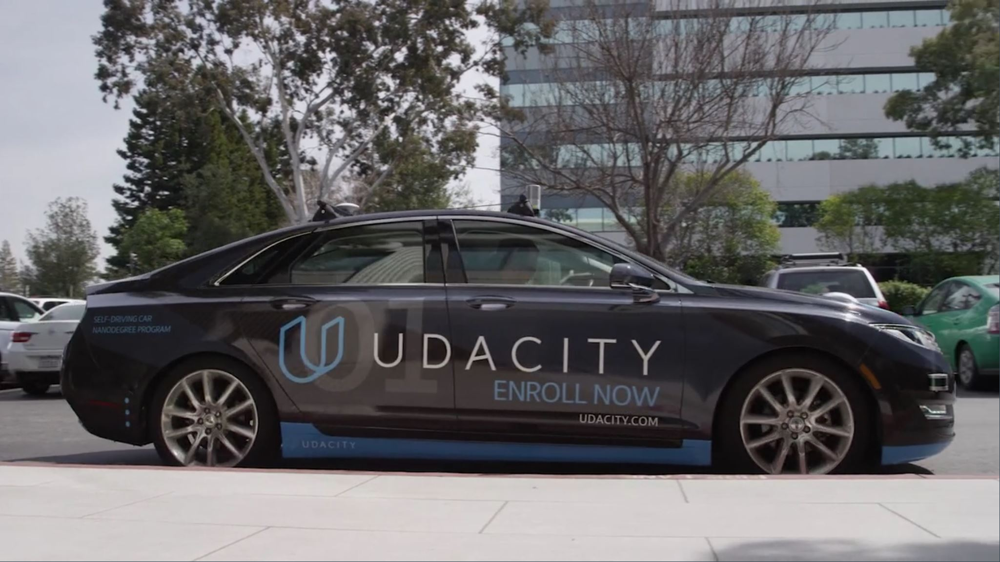
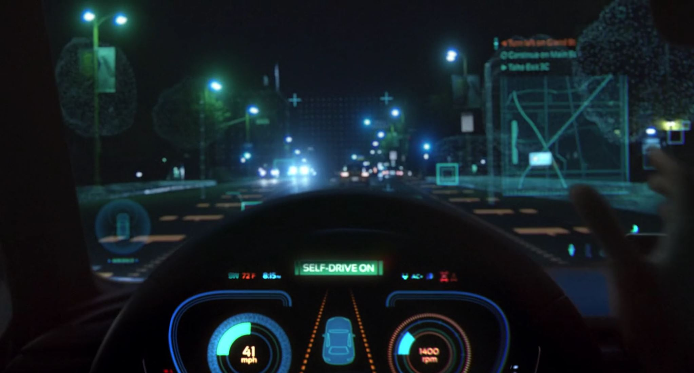
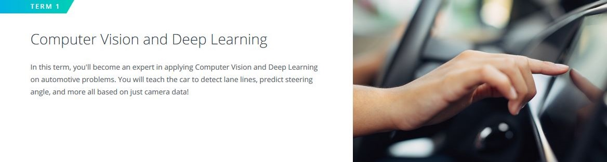
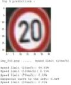
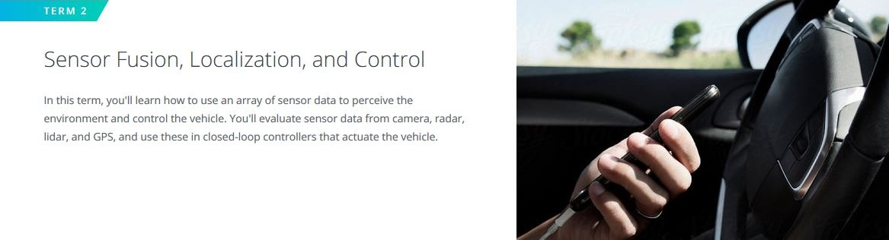
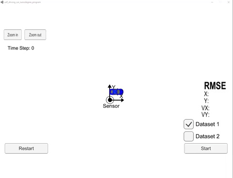
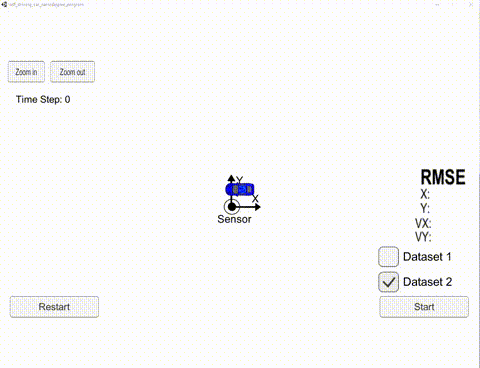
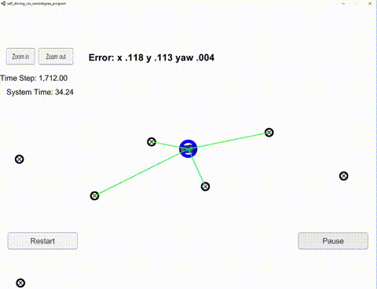
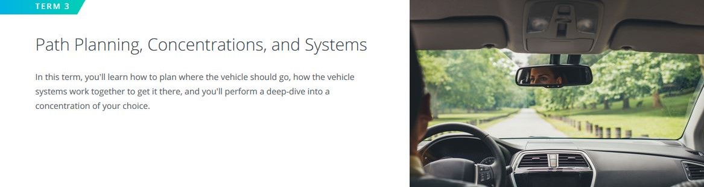

# Udacity Self-Driving Car Engineer Nanodegree 

  
Image: Udacity Self-Driving Car Nanodegree  

Learning to build the future, today!  

Self-driving cars represent one of the most significant advances in modern history. Their impact will go beyond technology, beyond transportation, beyond urban planning to change our daily lives in ways we have yet to imagine. Here are some considerations:

  - self-driving vehicles will save a lot of lives
  - they will make our lives also more comfortable (e.g. mobility for seniors) 
  - transport will be delivered as a service from companies who own fleets of self-driving vehicles 
  - transportation will become more tightly integrated and packaged into many services  
  - premium vehicle services will be available
  - beeing able to avoid crashes will change the vehicle body construction radically 
  - interior equipment will focus even more on comfort
  - emotion (max. speed, acceleration, handling, exterior design ..) might almost entirely leave transportation  
  - are parking lots or parking spaces in town centers necessary anymore?  
  - traffic flow will be better regulated
  - infrastructure utilization will be optimized
  - hugh amount of data will be collected and used
  - hacking of vehicles will be a serious issue
  - ...  

In this program you could learn the skills and techniques used by self-driving car teams at the most innovative companies in the world like NVIDIA, Mercedes-Benz, Uber ATG, Elektrobit. This amazing technology is practiced through interactive projects in computer vision, robotic controls, localization, path planning, machine learning and more.  

  
Image: Udacity Self-Driving Car Nanodegree  

In this repository I will share the **source code** of all the projects of **[Udacity Self-Driving Car Engineer Nanodegree](https://www.udacity.com/course/self-driving-car-engineer-nanodegree--nd013)**.  

### Projects  

--- 
## Table of Contents

----  

### Term 1: Computer Vision and Deep Learning

----  

----  

| [Getting Started for Term 1](./term1_How_to_get_started)       |  **Project 1: Finding Lane Lines on the road** [Code](./term1_project1_lane_finding)       |  **Project 2: Traffic Sign Classifier** [Code](./term1_project2_traffic_sign_classifier)       |
| :---:         |     :---:      |          :---: |
| ](./term1_project3_behavioral_cloning/results/video.mp4) **Project 3: Behavioral Cloning** [Code](./term1_project3_behavioral_cloning)       |  **Project 4: Advanced Lane Finding** [Code](./term1_project4_advanced_lane_finding)       | **Project 5: Vehicle Tracking ** [Code](./term1_project5_vehicle_detection)|

---  

### _Introduction_  
The program starts with a survey of how self-driving cars work and an immediately set out to the very first autonomous vehicle project - finding lane lines on the road!   

#### [P1 - Finding Lane Lines on the road](./term1_project1_lane_finding)
 - **Summary:** Detect lane lines on a highway within a video stream. Use OpencV image analysis techniques to identify lines of different colors.
 - **Keywords:** Python, Computer Vision, Hough Transforms, Canny edge detection
 
#### **Deep Learning**      
Deep learning has become the most important frontier in both machine learning and autonomous vehicle development. Experts from NVIDIA and Uber ATG teach to build deep neural networks and train them with data from the real world and from the Udacity simulator.  

#### [P2 - Traffic Sign Classification](./term1_project2_traffic_sign_classifier)
 - **Summary:** Build and train a deep neural network to classify traffic signs, using TensorFlow. Experiment with different network architectures. Performe image pre-processing and validation to guard against overfitting.
 - **Keywords:** Python, Deep Learning, Convolutional Neural Networks, TensorFlow, Overfitting, Generalisation, Augmentation, Optimizer
 
#### [P3 - Behavioral Cloning](./term1_project3_behavioral_cloning)
 - **Summary:** Build and train a convolutional neural network for end-to-end driving in a simulator, using TensorFlow and Keras. Use optimization techniques such as data augmentation and dropout to generalize the network for driving on multiple tracks.
 - **Keywords:** Python, Deep Learning, Keras, Convolutional Neural Networks, Generalisation
 
#### **Computer Vision**  
Use a combination of cameras, software, and machine learning to find lane lines on difficult roads and to track vehicles. Start with calibrating cameras and manipulating images, and end by applying support vector machines and decision trees to extract information from video.  

#### [P4 - Advanced Lane Finding](./term1_project4_advanced_lane_finding)
 - **Summary:** Write a software pipeline to identify the lane boundaries in a video from a front-facing camera on a car. Use distortion correction, image rectification, color transforms and gradient thresholding. Identify lane curvature and vehicle displacement with means of perspective transform and polynomial fit. Overcome environmental challenges such as shadows and pavement changes.
 - **Keywords:** Python, OpenCV, Sobel Operator, Color Spaces, Polynomial Fit  
 
#### [P5 - Vehicle Detection and Tracking](./term1_project5_vehicle_detection)
 - **Summary:** Create a vehicle detection and tracking pipeline with OpenCV. Use techniques like 'histogram of oriented gradients' (HOG) and train a classifier (e.g. support vector machines (SVM)) to identify cars. Implement the model in a pipeline. Use sliding windows to detect cars on video data from an automotive camera taken during highway driving. Use heat-map technique to combine overlapping detections and remove false positives.
 - **Keywords:** Python, Object Detection and Tracking, Linear SVC, SVC, Logistic Regression, MLP Classifier, Ensemble Classifier (Ada Boost, Bagging), Grid Search, Hard Negativ Minig, HOG, Sliding Window, Heatmap, False Positives  

 ---  

### Term 2: Sensor fusion and localization control

 ---  

|[Getting Started for Term 2](./term2_How_to_get_started)        | **Project 6: Extended Kalman Filters** [Code](./term2_project6_extended_kalman_filters)|  **Project 7: Unscented Kalman Filters** [Code](./term2_project7_unscented_kalman_filters)|
| :---:         |     :---:      |          :---: |
| **Project 8: Particle Filer - Kidnapped Vehicle** [Code](./term2_project8_particle_filter_kidnapped_vehicle)| **Project 9: PID Controller**  [Code](./term2_project9_PID_controller)| **Project 10: Model Predictive Control**  [Code](./term2_project10_Model_Predictive_Control)|

---  

#### [P6 - Extended Kalman Filter](./term2_project6_extended_kalman_filters)
 - **Summary:** Implement the extended Kalman filter in C++. Simulated lidar and radar measurements are used to detect a bicycle that travels around your vehicle. Use Kalman filter, lidar measurements and radar measurements  to track the bicycle's position and velocity.
 - **Keywords:** C++, Kalman Filter, CV motion model, Sensor fusion, Lidar, Radar

#### [P7 - Unscented Kalman Filter](./term2_project7_unscented_kalman_filters)
 - **Summary:**  Utilize an Unscented Kalman Filter to estimate the state of a moving object of interest with noisy lidar and radar measurements. A CTRV motion model, lidar measurements and radar measurements are used to track the bicycle's position and velocity. A consistency check with Normalized Innovation Squared (NIS) values is done. 
 - **Keywords:** C++, Unscented Kalman Filter, CTRV motion model, Sigma Points, Consistency Check, NIS
 
#### [P8 - Kidnapped Vehicle](./term2_project8_particle_filter_kidnapped_vehicle)
 - **Summary:** Your robot has been kidnapped and transported to a new location! Luckily it has a map of this location, a (noisy) GPS estimate of its initial location, and lots of (noisy) sensor and control data. In this project you will implement a 2 dimensional particle filter in C++. Your particle filter will be given a map and some initial localization information (analogous to what a GPS would provide). At each time step your filter will also get observation and control data.
 - **Keywords:** C++, Particle Filter
 
#### [P9 - PID Control](./term2_project9_PID_controller)
 - **Summary:** Implement a PID controller for keeping the car on track by appropriately adjusting the steering angle and try to get as near to 100mph by controlling the throttle at the same time.
 - **Keywords:** C++, PID Controller
 
#### [P10 - Model Predictive Control](./term2_project10_Model_Predictive_Control)
- **Summary:** Implement an MPC controller for keeping the car on track by appropriately adjusting the steering angle. Differently from previously implemented PID controller, MPC controller has the ability to anticipate future events and can take control actions accordingly. Indeed, future time steps are taking into account while optimizing current time slot.
- **Keywords:** C++, Model Predictive Control (MPC)

---  

### Term 3: Path Planning Concentration

---  

| **Project 11: Path Planning Project** [Code](./term1_project1_lane_finding)| **Project 12: Advanced Deep Learning** [Code](./term1_project1_lane_finding)| **Project 13: Functional Safety** [Code](./term1_project1_lane_finding)|
| :---:         |     :---:      |          :---: |
| **CAPSTONE PROJECT** **System Integration**| **Project 14: Programming a Real Self-Driving Car** [Code](./term3_project14_capstone_project)||

---  

#### [P11 - Path Planning](project_11_path_planning)
- **Summary:** The goal in this project is to build a path planner that is able to create smooth, safe trajectories for the car to follow. The highway track has other vehicles, all going different speeds, but approximately obeying the 50 MPH speed limit. The car transmits its location, along with its sensor fusion data, which estimates the location of all the vehicles on the same side of the road.
- **Keywords:** C++, Path Planning

#### [P12 - Road Segmentation](project_12_road_segmentation)
- **Summary:** Implement the road segmentation using a fully-convolutional network.
- **Keywords:** Python, TensorFlow, Semantic Segmentation

#### [CAPSTONE PROJECT - Programming a Real Self-Driving Car](./term3_project14_capstone_project)
- **Summary:** Programm a real driving car.
- **Keywords:** C++, ROS, CNN, Path Planning, Simulator & Real Car
 

  

Image: Udacity Self-Driving Car Nanodegree  

## Contributing

No further updates nor contributions are requested.  This project is static.

## License

**UDACITY-self-driving-car** results are released under the [MIT License](./LICENSE).