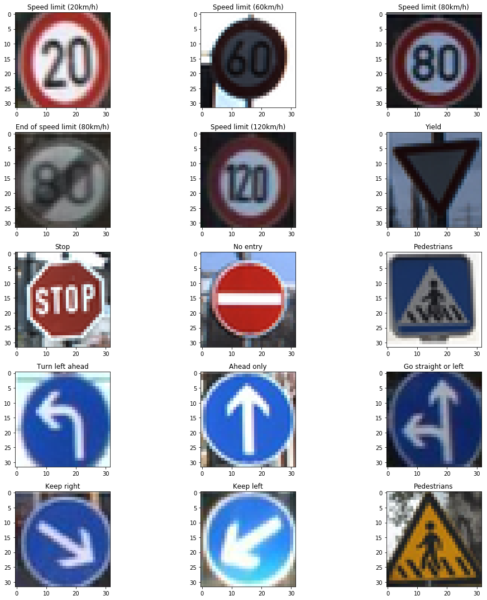

# Udacity Self-Driving Car Engineer Nanodegree 

  

Learning to build the future, today!  

Self-driving cars represent one of the most significant advances in modern history. Their impact will go beyond technology, beyond transportation, beyond urban planning to change our daily lives in ways we have yet to imagine. Here are some considerations:

  - self-driving vehicles will save a lot of lives
  - they will make our lives also more comfortable (e.g. mobility for seniors) 
  - transport will be delivered as a service from companies who own fleets of self-driving vehicles 
  - transportation will become more tightly integrated and packaged into many services  
  - premium vehicle services will be available
  - beeing able to avoid crashes will change the vehicle body construction radically 
  - interior equipment will focus even more on comfort
  - emotion (max. speed, acceleration, handling, exterior design ..) might almost entirely leave transportation  
  - are parking lots or parking spaces in town centers necessary anymore?  
  - traffic flow will be better regulated
  - infrastructure utilization will be optimized
  - hugh amount of data will be collected and used
  - hacking of vehicles will be a serious issue
  - ...  

In this program you could learn the skills and techniques used by self-driving car teams at the most innovative companies in the world like NVIDIA, Mercedes-Benz, Uber ATG, Elektrobit. This amazing technology is practiced through interactive projects in computer vision, robotic controls, localization, path planning, machine learning and more.  

[//]: # (Image References)
  

In this repository I will share the **source code** of all the projects of **[Udacity Self-Driving Car Engineer Nanodegree](https://www.udacity.com/course/self-driving-car-engineer-nanodegree--nd013)**.  

## Overview

### Projects

<table style="width:100%">
  <tr>
    <th>
      

           
            P1: Finding Lane Lines on the road
            <a href="./term1_project1_lane_finding" name="p1_code">(code)</a>
      

    </th>
        <th>

           
            P2: Traffic Signs
            <a href="./term1_project2_traffic_sign_classifier" name="p2_code">(code)</a>
        

    </th>
       <th>

           
            P3: Behavioral Cloning
            <a href="./project_3_behavioral_cloning" name="p3_code">(code)</a>
        

    </th>
        <th>

           
            P4: Adv. Lane Finding
            <a href="./project_4_advanced_lane_finding" name="p4_code">(code)</a>
        

    </th>
  </tr>
  <tr>
    <th>

           
            P5: Vehicle Detection
            <a href="./project_5_vehicle_detection" name="p5_code">(code)</a>
        

    </th>
        <th>

           
            P6: Ext. Kalman Filter
            <a href="./project_6_extended_kalman_filter" name="p6_code">(code)</a>
        

    </th>
    <th>

           
            P7: Unsc. Kalman Filter
            <a href="./project_7_unscented_kalman_filter" name="p7_code">(code)</a>
        

    </th>
    <th>

           
            P8: Kidnapped Vehicle
            <a href="./project_8_kidnapped_vehicle" name="p8_code">(code)</a>
        

    </th>
  </tr>
  <tr>
    <th>

           
            P9: PID Controller
            <a href="./project_9_PID_control" name="p9_code">(code)</a>
        

    </th>
    <th>

           
            P10: MPC Controller
            <a href="./project_10_MPC_control" name="p10_code">(code)</a>
        

    </th>
   <th>

           
            P11: Path Planning
            <a href="./project_11_path_planning" name="p11_code">(code)</a>
        

    </th>
    <th>

          
            P12: Road Segmentation
            <a href="./project_12_road_segmentation" name="p12_code">(code)</a>
        

    </th>
  </tr>
</table>

### Capstone
- [**Traffic light classifier:**](https://github.com/ndrplz/self-driving-car/tree/master/capstone_traffic_light_classifier) Simple traffic light classifier to be integrated in the capstone project.

--- 
## Table of Contents

### Term 1: Computer Vision and Deep Learning

---  

### Introduction  
The program starts with a survey of how self-driving cars work and an immediately set out to the very first autonomous vehicle project - finding lane lines on the road!   

#### [P1 - Finding Lane Lines on the road](term1_project1_lane_finding)
 - **Summary:** Detect lane lines on a highway within a video stream. Use OpencV image analysis techniques to identify lines of different colors.
 - **Keywords:** Computer Vision, Hough Transforms, Canny edge detection
 
#### **Deep Learning**      
Deep learning has become the most important frontier in both machine learning and autonomous vehicle development. Experts from NVIDIA and Uber ATG teach to build deep neural networks and train them with data from the real world and from the Udacity simulator.  

#### [P2 - Traffic Sign Classification](term1_project2_traffic_sign_classifier)
 - **Summary:** Build and train a deep neural network to classify traffic signs, using TensorFlow. Experiment with different network architectures. Performe image pre-processing and validation to guard against overfitting.
 - **Keywords:** Deep Learning, Convolutional Neural Networks, TensorFlow
 
#### [P3 - Behavioral Cloning](project_3_behavioral_cloning)
 - **Summary:** Build and train a convolutional neural network for end-to-end driving in a simulator, using TensorFlow and Keras. Use optimization techniques such as , data augmentation and dropout to generalize the network for driving on multiple tracks.
 - **Keywords:** Deep Learning, Keras, Convolutional Neural Networks
 
#### **Computer Vision**  
Use a combination of cameras, software, and machine learning to find lane lines on difficult roads and to track vehicles. Start with calibrating cameras and manipulating images, and end by applying support vector machines and decision trees to extract information from video.  

#### [P4 - Advanced Lane Finding](project_4_advanced_lane_finding)
 - **Summary:** Write a software pipeline to identify the lane boundaries in a video from a front-facing camera on a car. Use distortion correction, image rectification, color transforms, and gradient thresholding. Identify lane curvature and vehicle displacement with means of perspective transform and polynomial fit. Overcame environmental challenges such as shadows and pavement changes.
 - **Keywords:** OpenCV, Sobel Operator, Color Spaces  
 
#### [P5 - Vehicle Detection and Tracking](project_5_vehicle_detection)
 - **Summary:** Create a vehicle detection and tracking pipeline with OpenCV. Use techniques like 'histogram of oriented gradients' (HOG) and train a classifier (e.g. support vector machines (SVM)) to identify cars. Implement the model in a pipeline. Use sliding windows to detect cars on video data from an automotive camera taken during highway driving. Use heat-map technique to combine overlapping detections and remove false positives.
 - **Keywords:** Object Detection and Tracking, SVM, HOG, Sliding Window, Heatmap  

 ---  

### Term 2: Sensor fusion and localization control

 #### [P6 - Extended Kalman Filter](project_6_extended_kalman_filter)
 - **Summary:** Implement the extended Kalman filter in C++. Simulated lidar and radar measurements are used to detect a bicycle that travels around your vehicle. Kalman filter, lidar measurements and radar measurements are used to track the bicycle's position and velocity.
 - **Keywords:** C++, Kalman Filter

 #### [P7 - Unscented Kalman Filter](project_7_unscented_kalman_filter)
 - **Summary:**  Utilize an Unscented Kalman Filter to estimate the state of a moving object of interest with noisy lidar and radar measurements. Kalman filter, lidar measurements and radar measurements are used to track the bicycle's position and velocity.
 - **Keywords:** C++, Kalman Filter
 
  #### [P8 - Kidnapped Vehicle](project_8_kidnapped_vehicle)
 - **Summary:** Your robot has been kidnapped and transported to a new location! Luckily it has a map of this location, a (noisy) GPS estimate of its initial location, and lots of (noisy) sensor and control data. In this project you will implement a 2 dimensional particle filter in C++. Your particle filter will be given a map and some initial localization information (analogous to what a GPS would provide). At each time step your filter will also get observation and control data.
 - **Keywords:** C++, Particle Filter
 
 #### [P9 - PID Control](project_9_PID_control)
 - **Summary:** Implement a PID controller for keeping the car on track by appropriately adjusting the steering angle.
 - **Keywords:** C++, PID Controller
 
#### [P10 - MPC Control](project_10_MPC_control)
- **Summary:** Implement an MPC controller for keeping the car on track by appropriately adjusting the steering angle. Differently from previously implemented PID controller, MPC controller has the ability to anticipate future events and can take control actions accordingly. Indeed, future time steps are taking into account while optimizing current time slot.
- **Keywords:** C++, MPC Controller

---  

### Term 3: Path Planning Concentration

#### [P11 - Path Planning](project_11_path_planning)
- **Summary:** The goal in this project is to build a path planner that is able to create smooth, safe trajectories for the car to follow. The highway track has other vehicles, all going different speeds, but approximately obeying the 50 MPH speed limit. The car transmits its location, along with its sensor fusion data, which estimates the location of all the vehicles on the same side of the road.
- **Keywords:** C++, Path Planning

#### [P12 - Road Segmentation](project_12_road_segmentation)
- **Summary:** Implement the road segmentation using a fully-convolutional network.
- **Keywords:** Python, TensorFlow, Semantic Segmentation

 

  

## Contributing

No further updates nor contributions are requested.  This project is static.

## License

**UDACITY-self-driving-car** results are released under the [MIT License](./LICENSE).