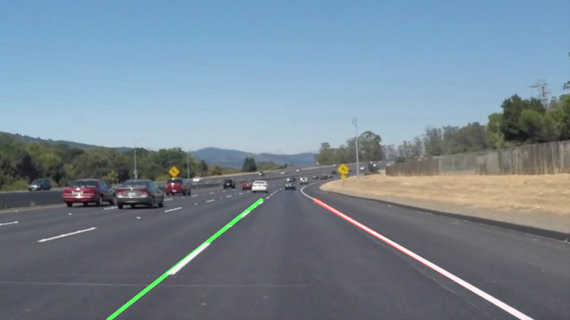
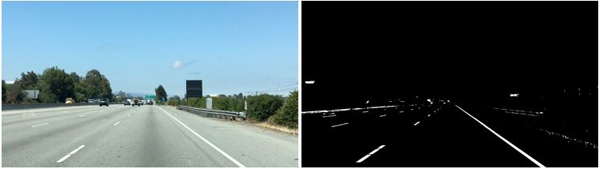
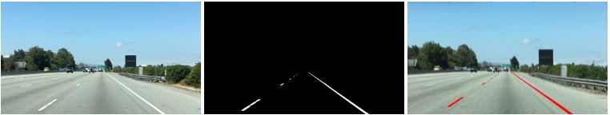
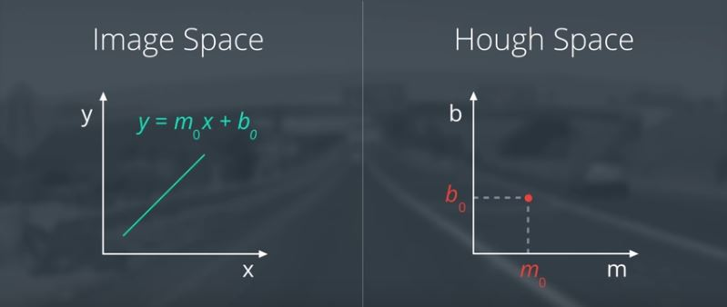
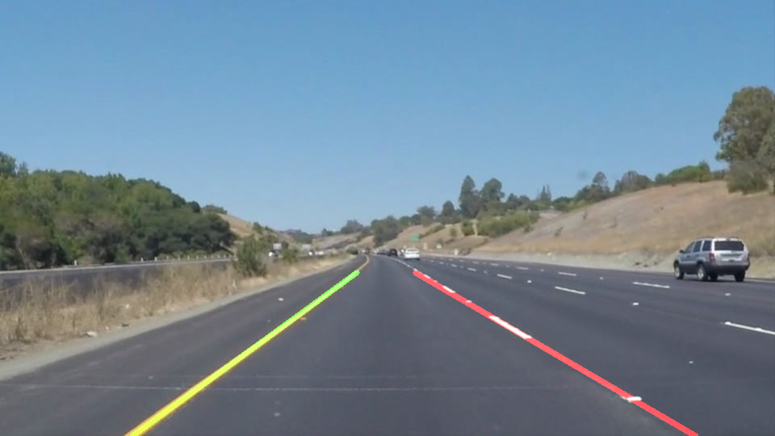

# **Finding Lane Lines on the Road** 

---

## Overview

When we drive, we use our eyes to decide where to go.  The lines on the road that show us where the lanes are act as our constant reference for where to steer the vehicle.  Naturally, one of the first things we would like to do in developing a self-driving car is to automatically detect lane lines using an algorithm.

In this project you will detect lane lines in images using Python and OpenCV.  OpenCV means "Open-Source Computer Vision", which is a package that has many useful tools for analyzing images.  

## Use Instructions

1. Clone or fork this repository.
2. Launch the Jupyter notebook: `jupyter notebook term1_project1_lane_finding.ipynb`
3. Execute the code cells you are interested in. Note that cells may depend on previous cells. The notebook explains clearly what each code cell does.

## Goal of this project

The first goal of this project was to **detect road lines** in an image taken from a roof-mounted camera. The next goal was to **create a simple detection pipeline** which could be applied to a video stream gathered with this camera. Different highway driving situations are available with a distinct level of  complexity in detection. This is just a **computer vision** project without any machine learning, but some tuning work to do. 

## General Process

The process used in this project roughly the following steps:

* First the color is filtered to eliminate non-line components. A very easy way to do so, is to performe a simple color selection for white and yellow.  

Image: Udacity Self-Driving Car Nanodegree  

* However, it would still be tricky to extract the exact lines automatically, because we still have some other objects detected around the periphery that aren't lane lines. As we could assume that the front facing camera that took the image, is mounted in a fixed position on the car, such that the lane lines will always appear in the same general region of the image. So we take advantage of this by adding a criterion to only consider pixels for color selection in the region where we expect to find the lane lines and apply a region filter.  

Image: Udacity Self-Driving Car Nanodegree  

* As it happens, lane lines are not always the same color, and even lines of the same color under different lighting conditions (day, night, etc) may fail to be detected by our simple color selection. So we need a more robust algorithm to detect lines of any color using sophisticated computer vision methods.

* Therefore we use a greyscaled image. Here we can compute the gradient, where the brightness of each pixel corresponds to the strength of the gradient at that point. Rapid changes in brightness are where we find the edges. With the canny algorithm we can thin out these edges to find just the individual pixles that follow the strongest gradients. Defining upper and lower threshold when calling the Canny function, a collection of points that identify the edges of the lines is gained. Unfortunately also edges of other objects are detected.  

Image: Udacity Self-Driving Car Nanodegree  

 * To suppress noise and spurios gradients, a Gaussian smoothing is included, before running the Canny function.
 
 * To find lines out of the dots of all the edges processed with Canny function, we should use a model of a line (y = mx + b). Then we can fit that model to the assortment of dots in the edge detection image. For that purpose we use the Hough Transform, which represents a line in the image space as a dot after transformation and a point in image space as a line. So we are looking for intersecting lines in Hough space to identify lines in image space.  
 
 
Image: Udacity Self-Driving Car Nanodegree  
  
 * With this tools we can identify the lane lines. But to get to an working pipeline for a video we should use a moving average filter to perform smoothing. 
 

## Results

The resulting videos are in the repo, if you are interested.  

## Contributing

No further updates nor contributions are requested.  This project is static.

## License

Term1_project1_lane_finding results are released under the [MIT License](./LICENSE)