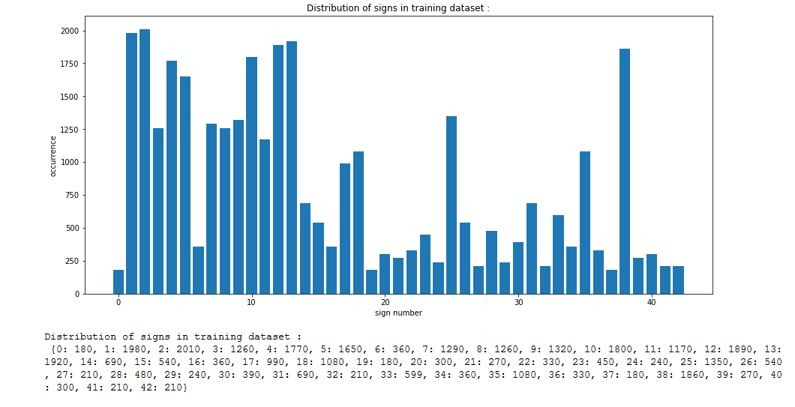
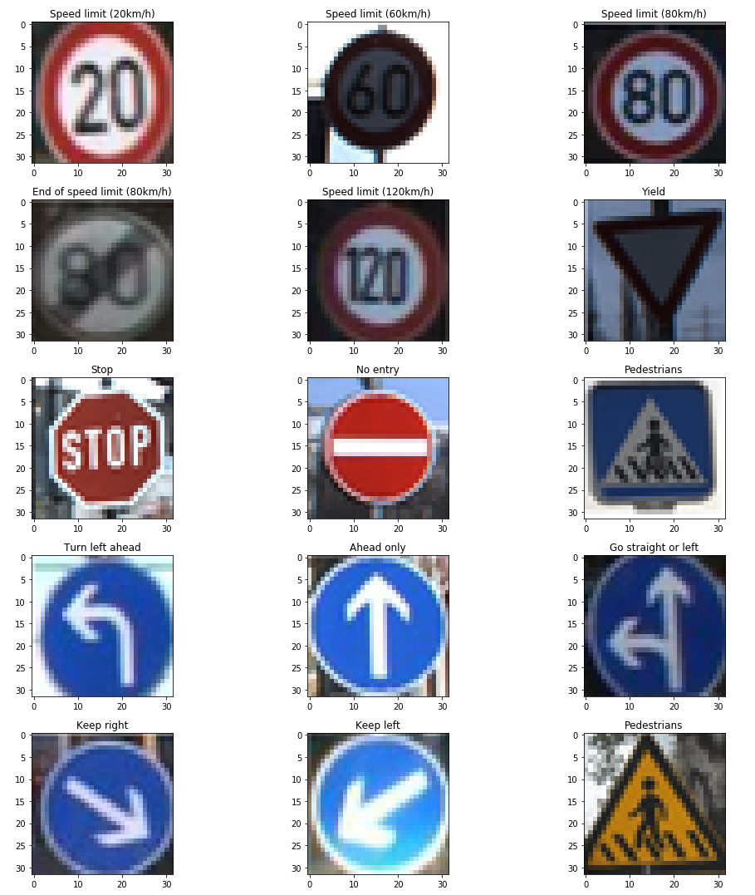
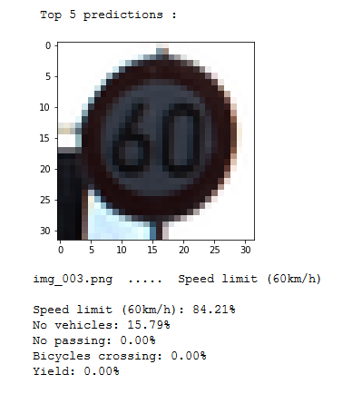
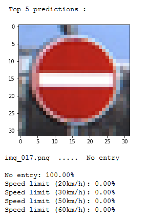
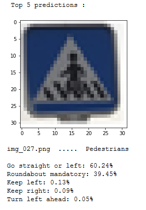

# Traffic Sign Classifier

## Overview

In this project a convolutional neural network is used to classify traffic signs. A model is trained so it can decode traffic signs from natural images by using the [German Traffic Sign Dataset](http://benchmark.ini.rub.de/?section=gtsrb&subsection=dataset). After training, the model will be tested on new images of traffic signs you can find on the web!

## Dependencies

CarND Starter Kit
If you have already installed all the necessary dependencies for the projects in term 1 you should be good to go! If not, you should install them to get started on this project => [Getting Started for Term 1](../term1_How_to_get_started). 

TensorFlow
If you have access to a GPU, you should follow the TensorFlow instructions for installing [TensorFlow with GPU support](https://www.tensorflow.org/install/#optional_install_cuda_gpus_on_linux).

Dataset
Download the dataset. You can download the pickled dataset in which we've already resized the images to 32x32 [here](https://d17h27t6h515a5.cloudfront.net/topher/2016/October/580d53ce_traffic-sign-data/traffic-sign-data.zip).
 
## Basic Build Instructions

1. Clone or fork this repository.
2. Launch the Jupyter notebook: `jupyter notebook P2_Traffic_Sign_Classifier.ipynb`
3. Execute the code cells you are interested in.
 
Note that cells may depend on previous cells. The notebook explains clearly what each code cell does.

## Goal of this project

The goal of this project was  to build a **CNN** in [TensorFlow](https://www.tensorflow.org/) to **classify traffic sign images** from the [German Traffic Sign Dataset](http://benchmark.ini.rub.de/?section=gtsrb&subsection=dataset).

Main steps covered in this lab are:
* Load the data set
* Explore, summarize and visualize the data set
* Design, train and test a model architecture
* Use the model to make predictions on new images
* Analyze the softmax probabilities of the new images

## Project Process 

A convolutional neural network was built and then trained to classify german traffic signs. For that purpose, a dataset with over 50000 images was used.

### Data Set Summary & Exploration

Data set summary:

* The size of training set is 34799 images
* The size of the validation set is 4410 images, that are 12.67% of the training set size
* The size of test set is 12630 images
* The shape of a traffic sign image is 32 x 32 x 3
* The number of unique classes/labels in the data set is 43

The different classes are:

  

Here 12 random traffic signs are shown:

  

The count - distribution of all classes over their class ID is visualized in the following bar chart:

  

### Training

The training data set is very unbalanced, which means that there are sometimes only 180 examples per class, and sometimes over 2000. This could lead to the fact, that the network is biased towards those categories containing more samples. To fix this, in the augmentation process for classes with only a minor couts more augmented images are generated.

All images from the training, validation and testing set are normalize, so that the range of the data is between 0.0 and 1.0, corresponding to the RGB values 0 to 255.

The training and validation set was already split by using the pickle data sets provided. Augmentation of the training set is created offline with various techniques like shifting, rotation, zomming, etc.

The convolutional neural network looks like this, with three convolutional layer, three fully connected layers, ReLU as activation function and Dropout for regularization:

  

The model was trained with a batch-size of 256 samples for 19 epochs. Early stopping to abort the training was used to avoid overfitting, when the accuracy did not make any notable progress after 2 epochs.

For the optimizer, the AdamOptimizer was used, which seemed to wrok a bit better than GradientDescent. A learning rate of 0.001 gave the best results. In addition to that, a dropout of 0.5 was doing quite fine.

Those plots show the validation accuracy over time:

  

### Results

My final model results are:

- Training set accuracy of 99.9% 
- Validation set accuracy of 99.7%
- Test set accuracy of 96.2%

Here are 15 traffic signs that I found on the web:

  

They were resized to fit into the input layer (32x32x1). One image (15th) is not german traffic signs, so it is interesting to see, how the network deals with this image.

Here are some results of the prediction:

  

  

The test accuracy on the new test data is 86.7%, which tells us that the model was able to correctly guess 13 of the 15 traffic signs. That is much less than on the test set. But keep in mind that the number of images is very small so a failed prediction has a large impact on the accuracy calculated in percent.

For all test images except for the two "pedestrians", the network is really certain about its answer. However the selected signs are all relatively clear visible so the CNN should do well. On the contrary the two signs “pedestrians” are more difficult to classify both from the pictogram and the number of occurrence in the training set, which were only 210. 

  

It even correctly classified the stop sign, although it was no german traffic sign, but the color information is discarded so it looks like a german one. It failed to classify the 70 km/h speed limit sign, because that one differs a lot from the german version. In spite of augmenting those classes more than the others the CNN can't completly catch up starting with this handicap. 

## Literature

[A committee of NNs for Traffic Sign Classification](./rersources/A_committee_of_NN_for_Traffic_Sign_Classification.pdf)

[Conception of data preprocessomg for ML Algorithm](./rersources/Conecption_of_data_preprocessomg_for_ML_algorithm.pdf)

[Multi column DNN for Traffic Sign Classification](./rersources/Multi_column_DNN_for_Traffic_sign_classification.pdf)

[Traffic Sign Recognition with Multi-Scale Convolutional Networks](./rersources/sermanet-ijcnn-11.pdf)

## Contributing

No further updates nor contributions are requested.  This project is static.

## License

Term1_project2_traffic_sign_classifier results are released under the [MIT License](./LICENSE)