# Behavioral Cloning
[](http://www.udacity.com/drive)

## Overview

In this project a simulator provided by [Udacity](https://www.udacity.com/) is used to collect data of a human driving behavior. This data contains images of three different cameras mounted on top of the vehicle, as well as the steering angle. A convolution neural network has been build, that receives the center image as input and predicts a steering angle to drive the car autonomously. This is a non-trivial regression tasks, therefore a powerful library was needed to realize it. The solutions is Keras, a Deep learning library that provides a high-level neural networks API, in this case for Tensorflow as a backend.

<p align="center">
  
</p>

## Dependencies

If you have already installed all the necessary dependencies for the projects in term 1 you should be good to go! If not, you should install them to get started on this project => [Getting Started for Term 1](../term1_How_to_get_started). 

The following resources can be found in this github repository:
* `drive.py`: a Python script that you can use to drive the car autonomously, once your deep neural network model is trained. It communicates with the simulator, receives images as input for the neural net and sends the steering angle and speed back.
* `model.py`: a script to create and train the model, it outputs the trained model afterwards.
* `model.h5`: contains the trained convolutional network, and is the best choice of the several trained parameter sets.
* `video.py`: a script that can be used to make a video of the vehicle when it is driving autonomously

## Details About Files In This Directory

### `drive.py`

Usage of `drive.py` requires you have saved the trained model as an h5 file, i.e. `model.h5`. See the [Keras documentation](https://keras.io/getting-started/faq/#how-can-i-save-a-keras-model) for how to create this file using the following command:
```sh
model.save(filepath)
```

Once the model has been saved, it can be used with drive.py using this command:

```sh
python drive.py model.h5
```

The above command will load the trained model and use the model to make predictions on individual images in real-time and send the predicted angle back to the server via a websocket connection.

Note: There is known local system's setting issue with replacing "," with "." when using drive.py. When this happens it can make predicted steering values clipped to max/min values. If this occurs, a known fix for this is to add "export LANG=en_US.utf8" to the bashrc file.

#### Saving a video of the autonomous agent

```sh
python drive.py model.h5 run1
```

The fourth argument, `run1`, is the directory in which to save the images seen by the agent. If the directory already exists, it'll be overwritten.

```sh
ls run1

[2017-01-09 16:10:23 EST]  12KiB 2017_01_09_21_10_23_424.jpg
[2017-01-09 16:10:23 EST]  12KiB 2017_01_09_21_10_23_451.jpg
[2017-01-09 16:10:23 EST]  12KiB 2017_01_09_21_10_23_477.jpg
[2017-01-09 16:10:23 EST]  12KiB 2017_01_09_21_10_23_528.jpg
[2017-01-09 16:10:23 EST]  12KiB 2017_01_09_21_10_23_573.jpg
[2017-01-09 16:10:23 EST]  12KiB 2017_01_09_21_10_23_618.jpg
[2017-01-09 16:10:23 EST]  12KiB 2017_01_09_21_10_23_697.jpg
[2017-01-09 16:10:23 EST]  12KiB 2017_01_09_21_10_23_723.jpg
[2017-01-09 16:10:23 EST]  12KiB 2017_01_09_21_10_23_749.jpg
[2017-01-09 16:10:23 EST]  12KiB 2017_01_09_21_10_23_817.jpg
...
```

The image file name is a timestamp of when the image was seen. This information is used by `video.py` to create a chronological video of the agent driving.

### `video.py`

```sh
python video.py run1
```

Creates a video based on images found in the `run1` directory. The name of the video will be the name of the directory followed by `'.mp4'`, so, in this case the video will be `run1.mp4`.

Optionally, one can specify the FPS (frames per second) of the video:

```sh
python video.py run1 --fps 48
```

Will run the video at 48 FPS. The default FPS is 60.

### Tips

Be careful: training images are loaded in BGR colorspace using cv2 while drive.py load images in RGB to predict the steering angles.

### Simulator

The simulator can be downloaded from [here](https://github.com/udacity/self-driving-car-sim). There are also [sample data](https://d17h27t6h515a5.cloudfront.net/topher/2016/December/584f6edd_data/data.zip) provided, that can optionally be used to help train the model.

Here are the latest updates to the simulator:
  1. Steering is controlled via position mouse instead of keyboard. This creates better angles for training. Note the angle is based on the mouse distance. To steer hold the left mouse button and move left or right. To reset the angle to 0 simply lift your finger off the left mouse button.
  2. You can toggle record by pressing R, previously you had to click the record button (you can still do that).
  3. When recording is finished, saves all the captured images to disk at the same time instead of trying to save them while the car is still driving periodically. You can see a save status and play back of the captured data.
  4. You can takeover in autonomous mode. While W or S are held down you can control the car the same way you would in training mode. This can be helpful for debugging. As soon as W or S are let go autonomous takes over again.
  5. Pressing the spacebar in training mode toggles on and off cruise control (effectively presses W for you).
  6. Added a Control screen
  7. Track 2 is now the Jungle theme with free assets , Note the track is challenging
  8. You can use brake input in drive.py by issuing negative throttle values
 
## Basic Instructions

1. Clone or fork this repository.
2. Launch simulator and chose `autonomous`
3. Run `python drive.py model.h5`

You need **Keras version 1.x** to run this project, with version 2.x there will be an error.

## Goal of this project

The goal of the project was to train a Deep Network to replicate the human steering behavior while driving, thus being able to drive autonomously on a simulator provided by [Udacity](https://www.udacity.com/). To this purpose, the network takes as input the frame of the frontal camera and predicts the steering direction at each instant.

The steps of this project are the following:
* **Data Collection:** Use the simulator to collect data of good driving behavior 
* **Image Processing:** Analyse, augment and process the gained images
* **Set up a Neural Network:** Design, train and validate a model that predicts a steering angle from image data
* **Test Model in Simulator:** Use the model to drive the vehicle autonomously around the track in the simulator. The vehicle should remain on the road for an entire loop around the track.

## Project Process

## Data Collection Strategy

Data for this task can be gathered with the Udacity simulator itself. Indeed, when the simulator is set to *training mode*, the car is controlled by the human though the keyboard, and steering directions and image data is collected through three forward facing cameras mounted on the vehicle.

<p align="center">
  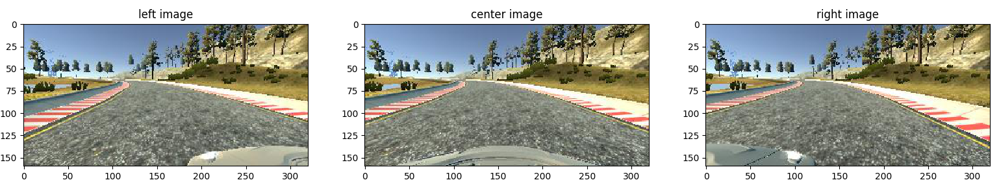
</p>

<p align="center">
  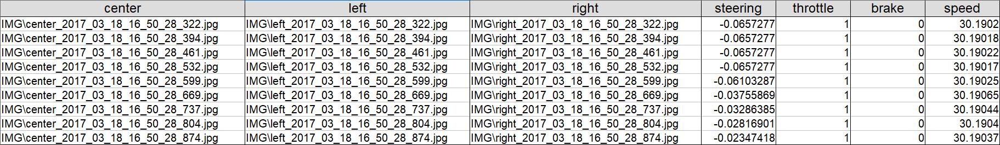
</p>

For training the model two different types of driving, **Controlled Driving** and **Recovery Driving** were carried out. 

In **controlled driving** the aim was to maintain the vehicle close to the center of the driving lane as it travelled through the simulator course. The following picture shows the distribution of the steering angle in the dataset.

<p align="center">
  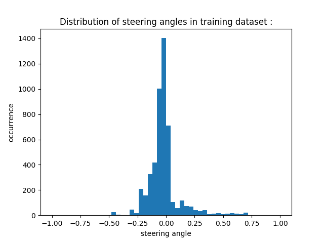
</p>

It is obvious that a significant portion of the data is just driving on a straight road with steering angles around 0°. This is not sufficient for successfully train a neural network, which should be able to recover back to the center once it has driven the car to the shoulder. The second item is that the data is biased to minus steering angles as the track is mostly bending to the left. This makes it difficult for the neural network to successfully manage right hand bends. Therefore an additional round but clockwise was collected additionally.

Next there is **recovery driving**. Here special manoeuvre are driven e.g. segments which started from the outside of the lane (on either side) and recorded the vehicle driving back towards the center of the lane. Inevitably there will be times when the car drifts beyond the images recorded from the side cameras in **controlled driving** and it must make a larger steering  correction back towards center. The recovery images trained the car to make this correction when it finds itself drifting towards the curb/lane lines on either side of the road. 

<p align="center">
  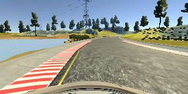
</p>

In the end the data set consists of the following driving manoeuvre:

  - 1 loop, centered driving, counter-clockwise  direction
  - 1 loop, centered driving, clock-wise direction
  - Additional manoeuvre for recovering to center
  - Additional manoeuvre for driving smooth in curves
  - Additional manoeuvre for critical waypoints

As a result the steering angle distribution looks as follows:

<p align="center">
  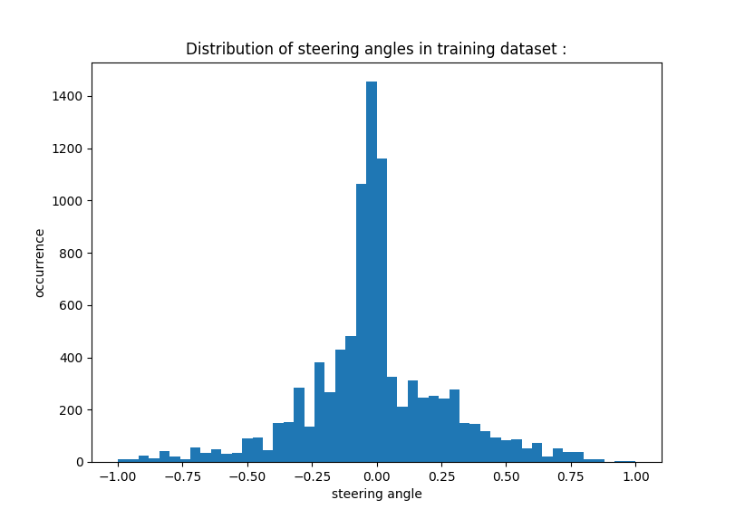
</p>

## Image Processing

But even with this distribution a neural network would *hardly* generalize enough to manage to get around the track. Various forms of data augmentation can help us to deal with these problems. 

### Image Augmentation

Data augmentation is a powerful tool to generate more data. In this case we benefit e.g. from three cameras positions on the car. This provides two advantages. First we get more data and second we can help the network to learn better to recover from the sides to the center of the road. Therefore the ground truth steering angle has to be appropriately corrected for the side camera images by adding a small amount of right turn to the left image labels and a small amount of left turn to the right image labels. This way of augmenting the data is also reported in the [NVIDIA paper](https://arxiv.org/pdf/1604.07316v1.pdf).

### Flipping

Another possiblity to combat against the left bias is to flip the images around y-axis. The steering angle also has to be inverted, which is done by multiplying it with a negative value of -1. Virtually the car drives now around a track in the counterclockwise direction, resulting in a majority of steering angles now being in the right direction.

Here are two examples of flipped images:

<p align="center">
  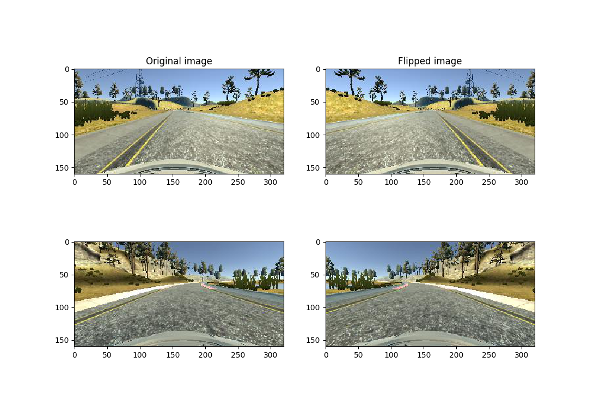
</p>

##### Brightness changes

Another way to force the model to better generalise is to alienate the images and to add them to the training data. One  possibility is to change the brightness of the images and therefor improving the ability of the model to deal with different lightning conditions. Before being fed to the network, each image is converted to HSV and the value channel is multiplied element-wise by a random value in a certain range. The wider the range, the more different will be on average the augmented frames from the original ones.

<p align="center">
  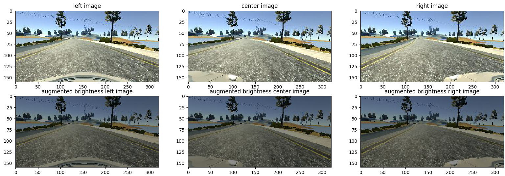
</p>  

Finally with using the above mentioned data augmentation technics, the steering angle distribution looks more like a Gaussian distribution: 

<p align="center">
  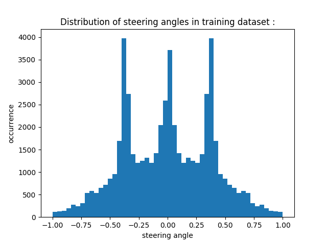
</p>  

### Images Preprocessing
The images outputted by the simulator are 160 by 320 pixels with 3 color channels (RGB). Every frame is preprocessed by cropping the upper and lower part of the frame so that an images with 75  by 320 pixels remains. In this way we discard information (e.g. blue sky, trees or engine hood) that is probably useless for the task of predicting the steering direction. As an agvantage this speeds up the training which would be extremely slow on full sized images. The cropping operation of course also has to be added to the "drive.py" script, as it is crucial that the new data is preprocessed in the same way. Now our input frames look like these: 

<p align="center">
  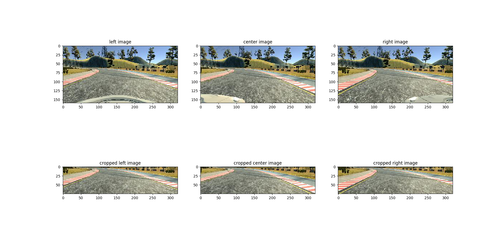
</p>  

Finally a normalization of the images to get the pixel values evenly distributed around zero was introduced to get good conditioned data and utmost numerical stability.

### Splitting Data

After doing all the mentioned driving manoeuvre the data set comprises around 15.000 images. With all augmentation technics like flipping it increased to nearly 30.000  images. The data set was split into a randomly selected training set (80%) and a validation set (the remaining 20%) to monitor the performance of the neural network and to ensure that the model was not overfitting. There is no need to split off a test set as the model testing is done by running the simulator in autonomous mode on the tracks. 

## Model Architectur

As this is a typical image classification problem a convolutional neural was choosen in order to maintain the spatial structure of the images, and the relationships between adjacent pixels. Convolutional neural networks avoid the problem of having to flatten the images into a 1 dimensional vector and are therefore more powerful in recognizing n-dimensional images. 
The model is inspired by [this Nvidia model](http://images.nvidia.com/content/tegra/automotive/images/2016/solutions/pdf/end-to-end-dl-using-px.pdf) where they trained a convolutional neural network for a similar type of problem. 

<p align="center">
  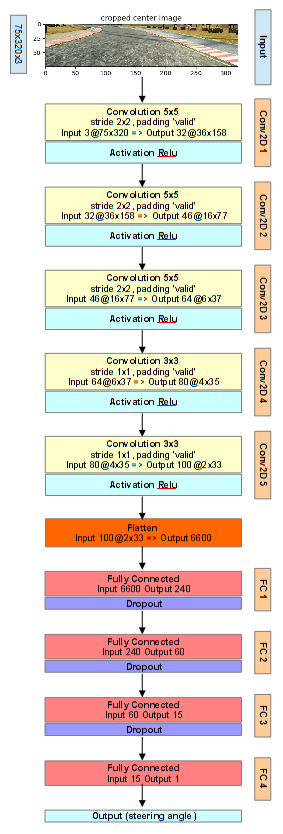
</p>  

Here three convolutional layers with 5x5 filter size and a stride of 2x2 each followed by a RELU activation layer to introduce nonlinearity was choosen. The next two layers consist of convolutional layers with 3x3 filter size and a stride of 1x1 based on the NVIDIA model also followed by a RELU activation layer. A filter depth between 32 and 100 was used. After that the flatten layer feds an output array of 1x6600 dimension to the first fully-connected layer which reduces the size to 240. This layer and the consecutive two fully-connected layers are each followed by a dropout layer to prevent the model from overfitting. Finally the last fully-connected layer outputs the steering angle prediction.

### Preventing overfitting

Despite the strong data augmentation mentioned above, there's still room for the major nightmare of the data scientis, a.c.a. overfitting. In order to prevent the network from just learning this specific training track, dropout layers are aggressively added after each fully-connected layer (*drop prob=0.6*) but the last one. A dropout rate of 0.6 means that 60% of the neurons are deactivated during training. Generally, 0.5 is a good value, but then more training data or epochs are needed for the remaining weights to build robust features. 

### Training Parameters

The model was compiled with an adam optimizer (learning rate = 6e-4), Mean Squared Error (mse) as a loss metric, and was set to train for 20 epochs with an early stopping callback which discontinues training when validation loss fails to improve for consecutive epochs. I chose to lower the learning rate in the adam optimizer because I found that the lower learning rate led to increased performance both in terms of mse and autonomous driving. When training is complete the model and weights are saved to be used for autonomous driving in the simulator.

### Preventing overfitting

Despite the strong data augmentation mentioned above, there's still room for the major nightmare of the data scientis, a.c.a. overfitting. In order to prevent the network from falling in love with the training track, dropout layers are aggressively added after each convolutional layer (*drop prob=0.2*) and after each fully-connected layer (*drop prob=0.5*) but the last one.

### Training Details

The figure below shows the final model loss and validation loss development over the epochs. The early stopping tool stopped at epoch 13. 

<p align="center">
  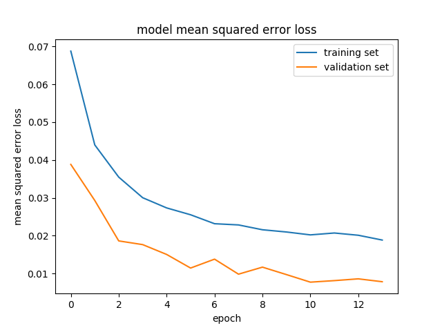
</p> 

## Results

The resulting [video](./results/video.mp4) is in the repo, if you are interested. 

## Literature

[End to End Learning for Self-Driving Cars](http://images.nvidia.com/content/tegra/automotive/images/2016/solutions/pdf/end-to-end-dl-using-px.pdf)

## Contributing

No further updates nor contributions are requested.  This project is static.

## License

Term1_project3_behavioral_cloning results are released under the [MIT License](./LICENSE)