# Advanced Lane Finding

## Overview

A lane detection and tracking program that uses a traditional (i.e. non-machine-learning) computer vision approach to detect lane lines is implemented here.

  

## Dependencies

If you have already installed all the necessary dependencies for the projects in term 1 you should be good to go! If not, you should install them to get started on this project => [Getting Started for Term 1](../term1_How_to_get_started). 
 
## Basic Build Instructions

1. Clone or fork this repository.
2. Launch the Jupyter notebook: `jupyter notebook P4_adv_lane_lines.ipynb`
3. Execute the code cells you are interested in. 
Note that cells may depend on previous cells. The notebook explains clearly what each code cell does.

## Goal of this project

The goal of this project is to develop a pipeline to process a video stream from a forward-facing camera mounted on the front of a car, and output an annotated video which identifies:
- The positions of the lane lines 
- The location of the vehicle relative to the center of the lane
- The radius of curvature of the road

## Advanced Lane Detection Pipeline

The pipeline created for this project processes images in the following steps:
- **Step 0**: Compute the camera calibration matrix and distortion coefficients given a set of chessboard images. 
- **Step 1**: Apply distortion correction using a calculated camera calibration matrix and distortion coefficients.
- **Step 2**: Apply color thresholds to create a binary image which isolates the pixels representing lane lines.
- **Step 3**: Apply a perspective transformation to warp the image to a birds eye view perspective of the lane lines.
- **Step 4**: Identify the lane line pixels and fit polynomials to the lane boundaries.
- **Step 5**: Determine curvature of the lane and vehicle position with respect to center.
- **Step 6**: Warp the detected lane boundaries back onto the original image.
- **Step 7**: Output visual display of the lane boundaries and numerical estimation of lane curvature and vehicle position.

### Step 0: Camera Calibration (Preparation for pipeline)
Image distortion occurs when a camera looks at 3D objects in real world and transforms them into a 2D image - this transformation isn’t perfect. Distortion actually changes what the shape and size of these 3D objects appear to be. The reason for this is that we use lenses in our camera system. They cause the light rays often to bend a little too much or too little at the edges of these lenses.  Another type of distortion is the tangential distortion, which occurs when the lenses aren't aligned perfectly parallel to the imaging plane. 
So, the first step in analyzing camera images, is to undo this distortion so that you can get correct and useful information out of them. Distortion correction is very important in the field of surveillance of the environment with optical systems as distortion (if not corrected) changes or makes:  

  - apparent size of an object in an image 
  - apparent shape of an object in an image
  - an object's appearance depending on where it's in the field of view
  - object's appear closer/farther away than they actually are.
 
This is best done using an chessboard as this is regular, has a high contrast pattern, is easy to detect automatically and we know what a undistorted chessboard looks like. We should use at least 20 images taken from different angles and distances to get a reliable calibration. At last a test images should be used to check the undistortion.

OpenCV provide some really helpful built-in functions for the task on camera calibration. First of all, to detect the calibration pattern in the [calibration images](./camera_cal/), we can use the function `cv2.findChessboardCorners(image, pattern_size)`. identify the locations of corners on a series of pictures of a chessboard taken from different angles.

Once we have stored the correspondeces between 3D world and 2D image points for a bunch of images, we can proceed to actually calibrate the camera through `cv2.calibrateCamera()`. The locations of the chessboard corners were used as input to this OpenCV function. Among other things, this function returns both the *camera matrix* and the *distortion coefficients*, which we can use to undistort the frames.

### Pipeline (single images)
### Step 1: Distortion Correction

Once the camera is calibrated, we can use the camera matrix and distortion coefficients we found to remove distortion from highway driving images. Indeed, if we want to study the *geometry* of the road, we have to be sure that the images we're processing do not present distortions. Here's the result of distortion-correction on one of the test images:

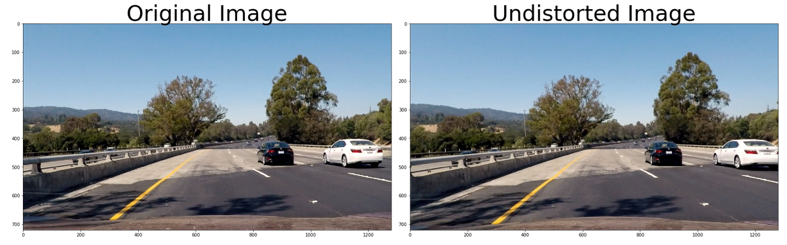

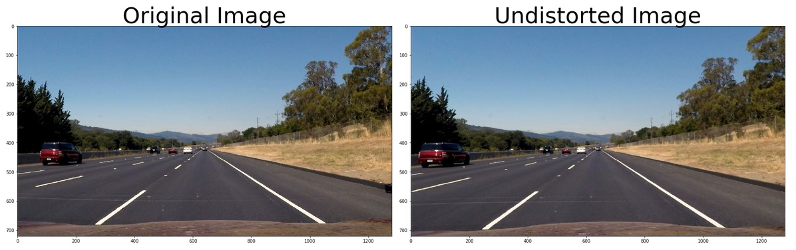

Notice that if you compare each two images, especially around the edges, there are obvious differences between the original and undistorted image, indicating that distortion has been removed from the original image.

To determine the curvature of the lane to predict the necessary steering angle for an autonomous car, we'll have to go through the following steps:
  - detect the lane lines using some masking and thresholding techniques
  - perform a perspective transform to get a birds eye view of the lane
  - fit a polynomial to the lane lines

### Step 2: Create a thresholded binary image

Correctly creating the binary image from the input frame is the very first step of the whole pipeline that will lead us to detect the lane. For this reason that is also one of the most important steps. If the binary image is bad, it's very difficult to recover and to obtain good results in the successive steps of the pipeline.

There are several threshold functions which could be used to generate a binary image and detect lane lines also under worse conditions like shadows and lower brightness. Here different function were used to manage this task.

  1. **Region of Interest**  
  This defines a mask (polygonial shape) in the image where you normally expect the lanes to be. The rest of the image is set to black.

  2. **Sobel Operator**  
  With canny-edge detection we found pixels in the image that were likely to be part of a line in project 1 'lane finding'. Here we use the sobel operator as we know that the lines we are looking for are close to vertical.  Applying the sobel operator to an images is a way of taking the derivative of the image in the x or y direction. With the results of the sobel operation the gradient in x or y direction is calculated Afterwards a threshold is applied to identify pixels within a certain gradient range.

  3. **Magnitude of the gradient**  
  The magnitude of the gradient is the square root of the sum of the squares in each direction, which can´t also be thresholded.

  4. **Direction of the gradient**  
  Another possibility to identify the lane lines more clearly is to select only lines with a certain orientation in the image. We can calculate the direction of the gradient by simply using the inverse tangent of the y gradient divided by the x gradient.

  5. **Color channel**  
  Besides those options a simple threshold to the color channel can be applied.

  6. **Differnet Color spaces**  
  Also using different color channels or different color spaces can be very useful.

  7. **Combination of all thresholds**  
  A combination of different binary thresholds, to create one combination thresholded image does a great job of highlighting almost all of the white and yellow lane lines.

  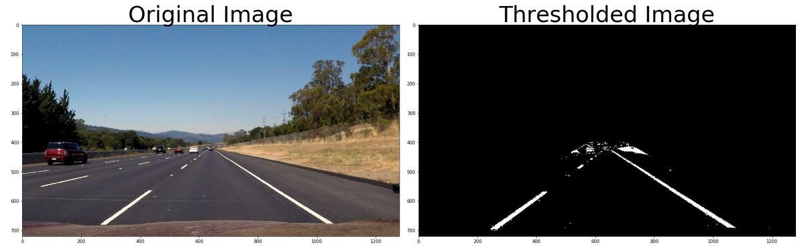

  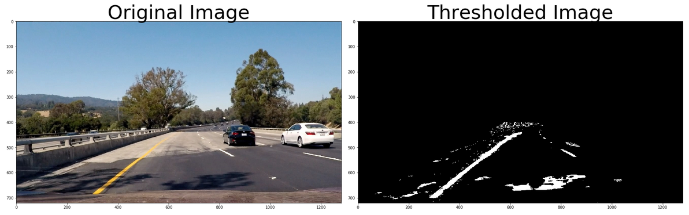

  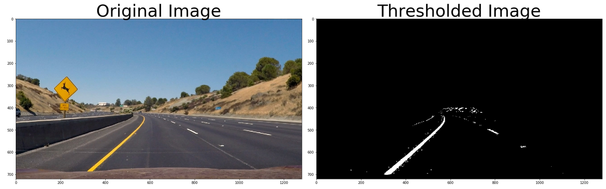

### Step 3: Perspective Transform
The goal of this step is to transform the undistorted image to a "birds eye view" of the road which focuses only on the lane lines and displays them in such a way that they appear to be relatively parallel to eachother (as opposed to the converging lines you would normally see). To achieve the perspective transformation the OpenCV functions `getPerspectiveTransform` and `warpPerspective` were applied which take a matrix of four source points on the undistorted image and remaps them to four destination points on the warped image. The source and destination points were selected manually by visualizing the locations of the lane lines on a series of test images.

The following image shows the original image with the rectangle source points on the left side and the undistorted and warped image with the destination points on the right side. As this is a straight lane the lines appear as parallel vertical lines in the result image.

<table style="width:100%">
  <tr>
    <th>
      

           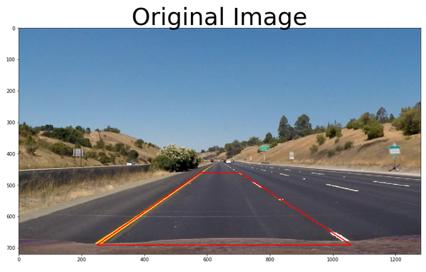
      

    </th>
    <th>
      

           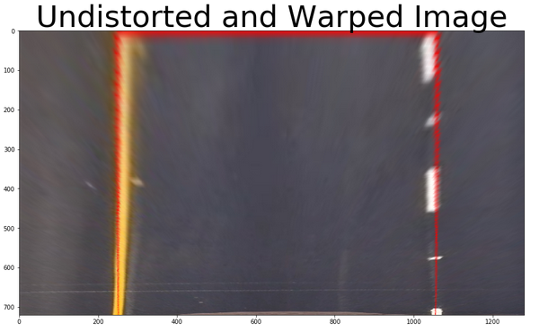
      

    </th>
  </tr>
</table>

Below an other example of a curved lane is shown, with a binary thresholded and warped image, as it is needed for the further steps:

  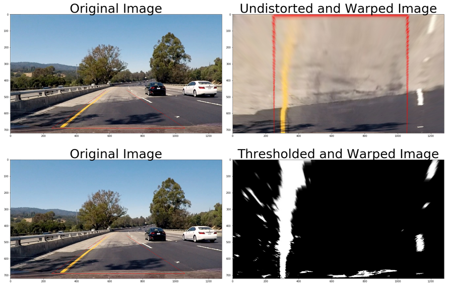

### Step 4: Fit a polynomial to the lane lines
To meet the goal of transforming the lane line pixels in a curved function form, the pixels must be identified first. Here we use a histogram along the driveway in the lower half of the image to identify the most prominent regions in the x direction of the image where we can expect the lanes to be. The histogram below shows a situation where the left line is definitely visible and identifiable but the right lane is more or less covered by noise.

  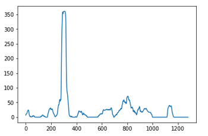

In order to identify which pixels of a given binary image belong to lane-lines, there are (at least) two possibilities. If a brand new frame arises, for whom it was never identified where the lane-lines are, an exhaustive search on the frame must be performed. This search is implemented in `slide_win_poly()`: starting from the bottom of the image, we slide two windows towards the upper side of the image, deciding which pixels belong to which lane-line. As a starting point we use precisely the position of the maximum peaks in the histogram of the binary image as well as the knowledge of the roadway width when we are dealing with noisy data.

On the other hand, if we're processing a video and we confidently identified lane-lines on the previous frame, we can limit our search to the neighborhood of the lane-lines we detected before. As  we're going at 30fps, the lines won't be so far away. This second approach is implemented in `nxt_win_poly()`.

One way to calculate the curvature of a lane line, is to fit a 2nd degree polynomial to that line, and from this you can easily extract useful information. After identifying an complete array of line pixels a polynomial is fitted to each lane using the numpy function `numpy.polyfit()`.

  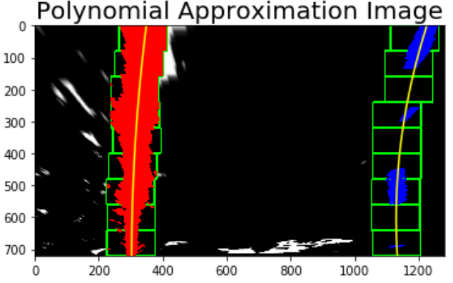

  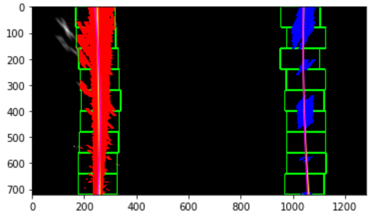

### Steps 5: Determine curvature of the lane and vehicle position with respect to center
The offset from the lane center can be computed under the hypothesis that the camera is fixed and mounted in the midpoint of the car roof. In this case, we can approximate the car's deviation from the lane center as the distance between the center of the image and the midpoint at the bottom of the image of the two lane-lines detected.

During the previous lane-line detection phase, a 2nd order polynomial is fitted to each lane-line. This function returns the 3 coefficients that describe the curve, namely the coefficients of both the 2nd and 1st order terms plus the bias. From this coefficients, following [this equation](http://www.intmath.com/applications-differentiation/8-radius-curvature.php), we can compute the radius of curvature of the curve.

Finally the pixel value for the distance from center and the curvature was converted from pixels to meters by multiplying the number of pixels by `3.7/700`. The final radius of curvature was taken by averaging the left and right curve radii.
 
### Step 6: Warp the detected lane boundaries back onto the original image.
The final step in processing the images was to plot the polynomials onto the warped image and fill the space between the polynomials to highlight the lane the car is actually in. After that another perspective trasformation was used to unwarp the image from birds eye back to its original perspective

### Step 7: Output visual display of the lane boundaries and numerical estimation of lane curvature and vehicle position.
Subsequently the distance from center and radius of curvature was printed to the final annotated image.

  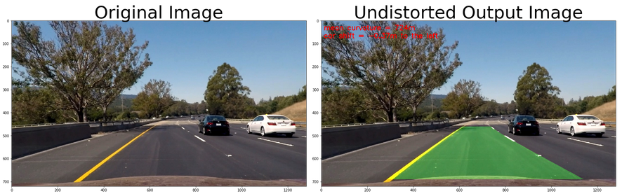

All other test images can be found in [./results/](./results/)

## Video Processing Pipeline:
After establishing a pipeline to process still images, the final step was to expand the pipeline to process videos frame-by-frame, to simulate what it would be like to process an image stream in real time on an actual vehicle. 

My goal in developing a video processing pipeline was to create an output as smooth as possible. To achieve this, I created a class for each of the left and right lane lines and stored features of each lane for averaging across frames.

The video pipeline first checks whether or not the lane was detected in the previous frame. If it was, then it only checks for lane pixels in close proximity to the polynomial calculated in the previous frame. This way, the pipeline does not need to scan the entire image, and the pixels detected have a high confidence of belonging to the lane line because they are based on the location of the lane in the previous frame. 

If at any time, the pipeline fails to detect lane pixels based on the previous frame, it will go back in to blind search mode and scan the entire binary image for nonzero pixels to represent the lanes.

In order to make the output smooth I chose to average the coefficients of the polynomials for each lane line over a span of 10 frames. The gif below is the result of my pipeline running on the test video provided for the project, as well as an  optional challenge video which presented additional challenges to the lane detection pipeline.

|Project Video|Challenge Video|
|-------------|-------------|
|||

## Results

The resulting [videos](./results/) are in the repo, if you are interested. 

## Contributing

No further updates nor contributions are requested.  This project is static.

## License

Term1_project4_advanced_lane_finding results are released under the [MIT License](./LICENSE)