# Vehicle Detection and Tracking

## Overview

The overarching theme in this module is how to find what you're looking for in images. You need to explore colors and gradients to see how you can locate and classify objects in images. Image classification is tricky. And it becomes even trickier when you don't know exactly where in an image your objects of interest will appear or what size they'll be or even how many of them you might find. Here we'll focus on the task of detecting vehicles and images taken from a camera mounted on the front of a car. But the same principles apply to pedestrian detection, or traffic sign detection, or identifying any object you might be looking for in an image. 

Object detection and tracking (traditional computer vision techniques) is a central theme in computer vision. Knowing where other vehicles are on the road and being able to anticipate where they're heading next is essentiall in a self-driving car. When we look at the world through our own eyes, we're constantly performing classification tasks with our brain. Much the same way as we do with our own eyes as we drive, reliable object detection and classification are essential in the case of self- riving cars to be to determine things like how far away they are, which way they're going, and how fast they're moving.

Here both techniques are important:

  - traditional computer vision techniques (you basically tune all parameters by hand)
  - deep learning (works even better for the same task)

Learning both approaches you can gain maximum insight and get the best performance in your algorithms!!

  

## Dependencies

If you have already installed all the necessary dependencies for the projects in term 1 you should be good to go! If not, you should install them to get started on this project => [Getting Started for Term 1](../term1_How_to_get_started). 

Here are links to the labeled data for [vehicle](https://s3.amazonaws.com/udacity-sdc/Vehicle_Tracking/vehicles.zip) and [non-vehicle](https://s3.amazonaws.com/udacity-sdc/Vehicle_Tracking/non-vehicles.zip) examples to train your classifier.  These example images come from a combination of the [GTI vehicle image database](http://www.gti.ssr.upm.es/data/Vehicle_database.html), the [KITTI vision benchmark suite](http://www.cvlibs.net/datasets/kitti/), and examples extracted from the project video itself.   You are welcome and encouraged to take advantage of the recently released [Udacity labeled dataset](https://github.com/udacity/self-driving-car/tree/master/annotations) to augment your training data.  

Some example images for testing the pipeline on single frames are located in the `test_images` folder. Examples of the output from each stage of the pipeline are saved in the folder called `ouput_images`. In this writeup it is explained what each image shows. The video called `project_video.mp4` is the origianl video and in the folder `results` is the output video of the pipeline.
 
## Basic Build Instructions

1. Clone or fork this repository.
2. Launch the Jupyter notebook: `jupyter notebook P5_vehicle_detection.ipynb`
3. Execute the code cells you are interested in.
4. Launch the Jupyter notebook: `jupyter notebook P5_vehicle_detection_helpfunctions.ipynb`. Here are tools for preprocessing (e.g. augmentation) of the training images.
Note that cells may depend on previous cells. The notebook explains clearly what each code cell does.

## Goal of this project

The goal of the project was to develop a pipeline to reliably detect cars in a given video from a roof-mounted camera. A labeled dataset is provided and the job is to decide what features to extract, then train a classifier and ultimately track vehicles in a video stream. 

The steps of this project are the following:

* Perform a Histogram of Oriented Gradients (HOG) feature extraction on a labeled training set of images and train a classifier Linear SVM classifier
* Optionally, you can also apply a color transform and append binned color features, as well as histograms of color, to your HOG feature vector. 
* For those first two steps don't forget to normalize the features and randomize a selection for training and testing.
* Implement a sliding-window technique and use the trained classifier to search for vehicles in images.
* Run the pipeline on a video stream and create a heat map of recurring detections frame by frame to reject outliers and follow detected vehicles.
* Estimate a bounding box for vehicles detected.

## Project Process
### Histogram of Oriented Gradients (HOG)

#### Extract HOG features from the training images.

In the field of computer vision, a *features* is a compact representation that encodes information that is relevant for a given task. In our case, we must explore what features are most helpful for a classifier to distinguish between *car* and *non-car* image patches as accurately as possible.

1. Read in all `vehicle` and `non-vehicle` images.
Here are two example images, the first from the `vehicle` class and the second from the `non-vehicle` class:
  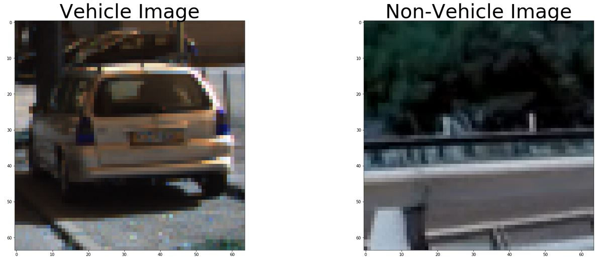
  
2. Use `skimage.feature.hog(training_image, [parameters=parameter_values])` to extract HOG features and HOG visualisation.
    * Wrapped in function `get_hog_features`.
    
For the task of car detection I used *color histograms* and *spatial features* to encode the object visual appearence and HOG features to encode the object's *shape*. While the first two features are easy to understand and implement, HOG features can be a little bit trickier to master.

#### Choose HOG parameters.

HOG stands for *Histogram of Oriented Gradients* and refer to a powerful descriptor that has met with a wide success in the computer vision community, since its in 2005 with the main purpose of people detection. 

  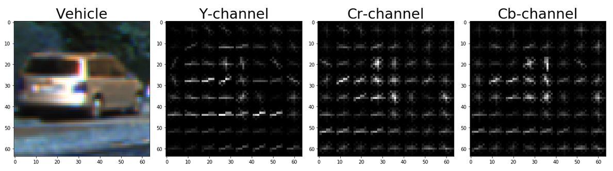
   Representation of HOG descriptors for a car patch.

  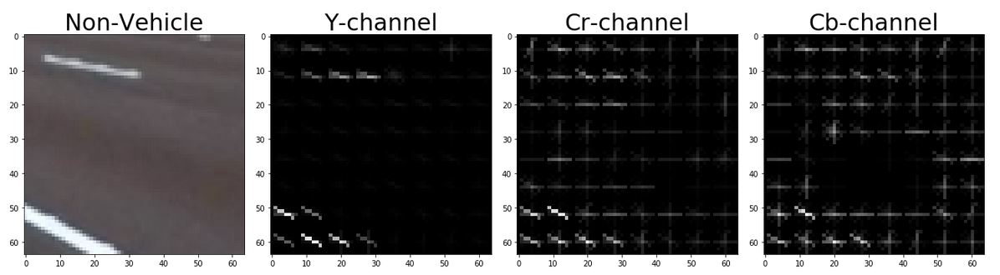
   Representation of HOG descriptors for a non-car patch.

The bad news is, HOG come along with a *lot* of parameters to tune in order to work properly. The main parameters are the size of the cell in which the gradients are accumulated, as well as the number of orientations used to discretize the histogram of gradients. Furthermore, one must specify the number of cells that compose a block, on which later a feature normalization will be performed. Finally, being the HOG computed on a single-channel image, arises the need of deciding which channel to use, eventually computing the feature on all channels then concatenating the result.

In order to select the right parameters, both the classifier accuracy and computational efficiency are to consider. After various attemps, the following parameters were choosen:

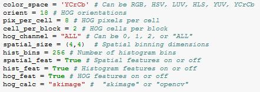

Additionally to the HOG features other functions were added as well to make use also from color and spatial information in the images. The advantage is that by using e.g. the color information we are independent of the structure. Therefore, objects which appear in different aspects and orientations (as trained with the images dataset) will still be matched.

#### Train a classifier using selected HOG features and colour features.

######################
Once decided which features to used, we can train a classifier on these. First to get a hugher training and validiation set, a augmentation of the existing images like shifting, rotating, zooming and shearing could be done. 

  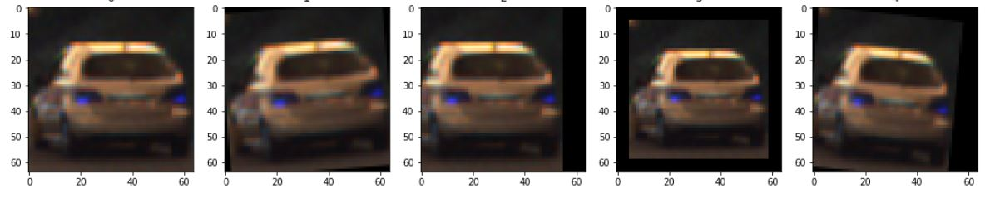
   Representation of augmented vehicle images.

  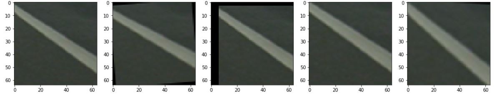
   Representation of augmented non-vehicle images.

After that, for each image in the databases `vehicle` and `non-vehicle` a feature vector is extracted. The data is split into shuffled training, validation and test sets so that these sets are composed as the set of car and non-car features (labels are given accordingly). Furthermore, feature vectors are standardize in order to have all the features in a similar range and ease training.

After that a training with a classifier of your choice could be done. In order to have an idea of the classifier performance, we can make a prediction on the test set. Here the following classifier were examined:
  - Logistic Regression Classifier
  - Multi-layer Perception
  - linearSVC
  - SVM with different kernels
And two ensemble classifier:
  - Adaboost with decision tree
  - Bagging  with decision tree

To optimize each classifier before judging which would be the best to identify the vehicles `grid search` was used: 
As a final result the linearSVC was choosen with max_iter = 10 and C = 0.1 as a best pick as well as in speed and in accuracy.

  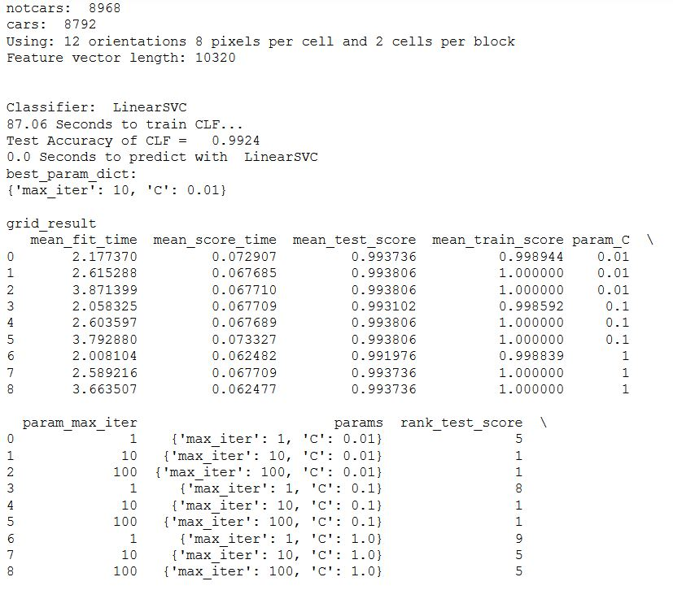
   Results of grid search with Linear SVC.

### Sliding Window Search

#### Implement a sliding window search.

Now to detect the position of a vehicle in a video frame, it is necessary to select a subregion of the image, run the classifier on each subregion to see if it contains a vehicle or not. Therefore I implemented a sliding-window function (here called `mul_win_slide`).

1. Define windows to search for vehicles:
    * Restrict search space to lower half of the image where vehicles are likely to occur.
    * As there might appear vehicle of different sizes at different positions three different window scales were used
    * As small vehicles appear more likely near the horizon, the area for the different scaled windows are resticted to different areas in y direction.
    * Keeping the aspect ratio in mind, we can crop also different x areas for the different sizes and positions of the windows
    * To be more robust in vehcile detection a 75% overlap is used
2.  With defined window sizes, we will step across the image in a grid pattern:
    * For each window, 
        * extract features for that window, 
        * scale extracted features to be fed to the classifier, 
        * predict whether the window contains a car using our trained Linear SVC classifier, 
        * and save the window if the classifier predicts there is a car in that window.

  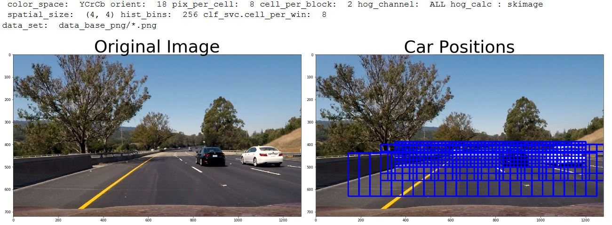
   Sliding windows search grid.

Sample image for vehicle detection:

  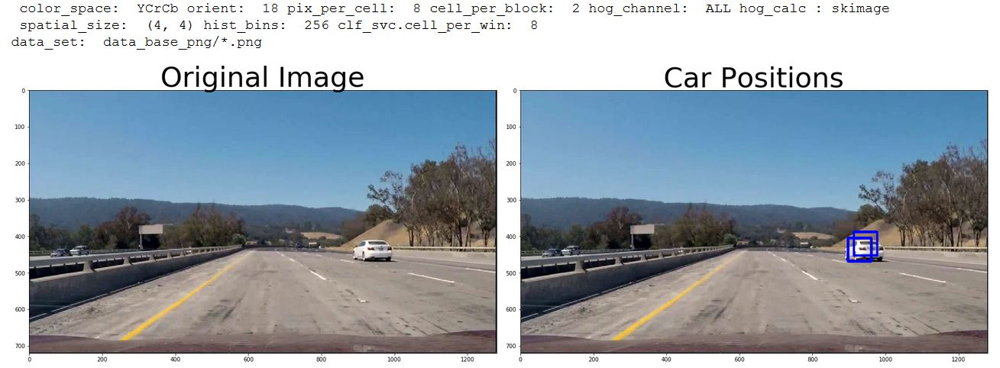
   Car detection Raw Boxes.

  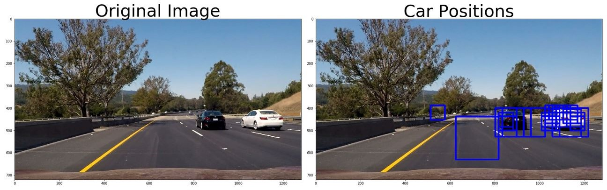
   Car detection Raw Boxes with positive false.

As you can see we have to deal with:

  - multiple detections at (or nearly) the same position as well as with
  - positive false detections in the lower image. 

So the aim is to get a tight bounding box for each car independent of a multiple or a single detection as a path-planning or motion control algorithm might take actions, where it isn't necessary or even dangerous. This is the same with the false detections as this can lead to actions like emergency breaking. 
So having all positive detections saved in the 'car_boxes_raw' list, a heatmap is created and thresholded to identify the vehicle positions and eliminate some further positive false recognitions. This is done in the picture pipeline as well as in the video pipeline afterwards.
After that `scipy.ndimage.measurements.label()` is used to identify individual positions in the heatmap, assuming each positions corresponds to a vehicle.  The bounding boxes are construced to cover the area of each detected blob.

Below are some examples showing the images with all positive detections. Then the resulting heatmap with a threshold of 2 windows at each position. Besides that the label image (the result of `scipy.ndimage.measurements.label()`) with the identified “vehicles”. On the right side the resulting images with  detected vehicles and tight bounding boxes drawn around are presented.

  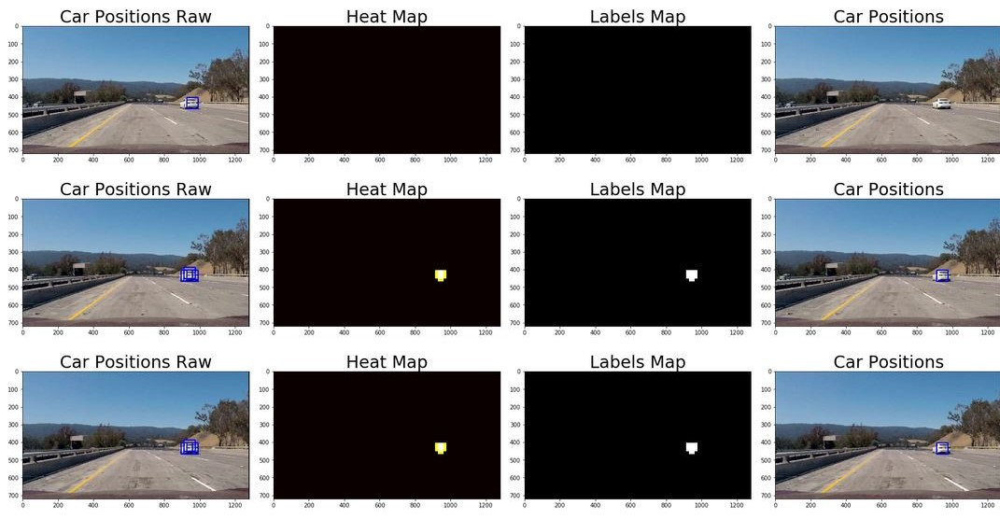

In this set one problem is clearly visible. There is no vehicle detected in the first row as heatmap threshold filters out the single remaining window in the raw window set. Therefore in the video pipeline a ring buffer is installed to save the predictions of the last n frames to bridge some frames with no detection.

This set below shows how positive false detections are correctly filtered out. But the chosen size of all searching windows as well as positive false detections can lead to a larger bounding box (1st row)  which is undesirable. With having two 'gates' to eliminate positive false detections ( svc.desision_function and heatmap threshold) there are a lot of parameters to eliminate the remaining  positive false detections (3rd row).

  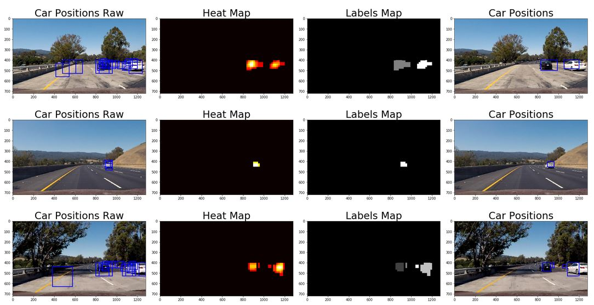

## Results

The resulting [video](./results/) is in the repo, if you are interested. 

## Literature

[Histograms of Oriented Gradients for Human Detection](./results/Dalal-cvpr05.pdf)

[Hard Negativ Mining](http://www.csc.kth.se/cvap/cvg/rg/materials/hossein_005_slides.pdf)

[LinearSVC](http://scikit-learn.org/stable/modules/generated/sklearn.svm.LinearSVC.html#sklearn.svm.LinearSVC.decision_function)

[What is the influence of C in SVMs with linear kernel](https://stats.stackexchange.com/questions/31066/what-is-the-influence-of-c-in-svms-with-linear-kernel)

[Grid Search](http://scikit-learn.org/stable/modules/grid_search.html)

## Contributing

No further updates nor contributions are requested.  This project is static.

## License

Term1_project5_vehicle_detection results are released under the [MIT License](./LICENSE)