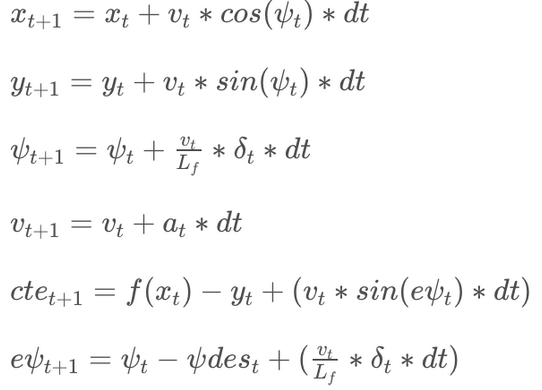

# Model Predictive Control (MPC)
Model predictive control (MPC) is an advanced method of process control which relies on dynamic models of the process. Differently from previously implemented PID controller, MPC controller has the ability to anticipate future events and can take control actions accordingly. Indeed, future time steps are taking into account while optimizing current time slot. Here a model predictive controller (MPC) for 2D vehicle trajectories is implemented in C++.

## Overview

The controller steers a car around a race track in the simulator linked below. The yellow line shows the reference trajectory, the green line shows the controller's projected trajectory based on the sequence of actuations computed by the optimizer.

## Dependencies

If you have already installed all the necessary dependencies for the projects in term 2 you should be good to go! If not, you should install them to get started on this project => [Getting Started for Term 2](../term2_How_to_get_started). 

In addition you need the following dependencies:

* **Ipopt and CppAD:** Please refer to [this document](https://github.com/udacity/CarND-MPC-Project/blob/master/install_Ipopt_CppAD.md) for installation instructions.
* [Eigen](http://eigen.tuxfamily.org/index.php?title=Main_Page). This is already part of the repo so you shouldn't have to worry about it.
* Simulator. You can download these from the [releases tab](https://github.com/udacity/self-driving-car-sim/releases).
* Not a dependency but read the [DATA.md](./DATA.md) for a description of the data sent back from the simulator.
 
## Basic Build Instructions

1. Clone this repo.
2. Make a build directory: `mkdir build && cd build`
3. Compile: `cmake .. && make`
   * On Windows, you may need to run: `cmake .. -G "Unix Makefiles" && make`
4. Run it: `./mpc`

Once you launched the executable, simply run the simulator app and select the MPC Controller simulation.

## Goal of this project

MPC solves control as an optimization problem. Using an appropriate motion model, it computes a vehicle's predicted state for a finite number of time steps in the future. The optimization problem consists of choosing the vehicle's actuator controls (throttle/braking and steering) so that the predicted state at each time step given the motion model is as close as possible to the desired state of the reference trajectory. The basic idea of the MPC approach is to minimize a cost function associated with that motion model. 

## MPC controller framework

There are four main components in the MPC controller framework:

- **Trajectory** taken in consideration during optimization. This is parametrized by a number of time steps ***N*** spaced out by a time ***dt***. Clearly, the number of variables optimized is directly proportional to *N*, so this must be considered in case there are computational constraints.
 
 - **Vehicle Model**, which is the set of equations that describes system behavior and updates across time steps. In our case, we used a simplified kinematic model (so called *bycicle model*) described by a state of six parameters:  
   _State:_
    - **x** car position (*x-axis*)
    - **y** car position (*y-axis*)
    - **ψ** car's heading direction
    - **v** car's velocity
    - **cte** cross-track error
    - **epsi** orientation error 
 
 The variables x, y, ψ and v are received from the simulator. The x, y position are in the map coordinates and are converted into the vehicle coordinate system.  

  _Actuators_  
  There are two actuators here:
   - **δ** - steering angle 
   - **a** - throttle (which also includes negative acceleration - braking)  
  These are obtained from the result of the solver and passed to the simulator.    

  _Update equations_  
  The new state is obtained from the previous state by applying the kinematic model equations:
 

  

 - **Contraints** necessary to model contrants in actuators' respose. For instance, a vehicle will never be able to steer 90 deegrees in a single time step. In this project we set these constraints as follows:
   - **steering**: bounded in range [-25°, 25°]
   - **acceleration**: bounded in range [-1, 1] from full brake to full throttle
   
 - **Cost Function** on whose optimization is based the whole control process. Usually cost function is made of the sum of different terms. Besides the main terms that depends on reference values (*e.g.* cross-track or heading error), other regularization terms are present to enforce the smoothness in the controller response. The implemented cost function takes the following components into account:
    1. The cross-track error, which is the orthogonal distance between the reference trajectory curve and the vehicle.
    2. The orientation error, which is the difference between the vehicle's actual orientation and the orientation the vehicle should have if it followed the reference trajectory.
    3. The velocity error, which is the difference between the desired velocity and the vehicle's actual velocity.
    4. The steering actuation value.
    5. The throttle actuation value.
    6. The steering actuation change rate.
    7. The throttle actuation change rate.

   The optimizer seeks to minimize all of the above. Minimization of the last four components serves to yield smooth driving behavior. By minimizing the use of the actuators and minimizing the change of actuation over time, the optimizer avoids extreme actuation values or abrupt changes in steering angles or throttle.

   _Cost function weights_

   The individual cost function components could be weighted individually.
   While it might seem intuitive to assign a large weight to the cross-track error, the orientation error is actually a lot more important for a smooth driving experience if we can afford to deviate slightly from the reference trajectory, which, in this race track scenario, we can. If the weight of the cross-track error is very large, the controller will aggressively try to steer back exactly to the reference trajectory. In this scenario though, we care more about the car heading in the **direction** of the reference trajectory rather than the car being precisely **on** the reference trajectory. In a regular street traffic scenario, following the reference trajectory extremely closely will usually be critical, so that a higher CTE weight would be appropriate in this case.

   With high values for the steering value and the steering change rate we could force the controller to follow a smooth trajectory. Keeping the steering values minimal means the optimizer will prefer a sequence of many small steering actuations over few large steering actuations. Keeping the steering angle change rate minimal means the optimizer will prefer smooth turns over abrupt turns. These two weights are the single most important weights in this cost function. But keep in mind that the controller must be able to react fast in sharp turns. So the weights need to be tuned very careful.

### Optimization of the time horizon

Both ***N*** and ***dt*** are fundamental parameters in the optimization process. In particular, ***T = N * dt*** constitutes the *prediction horizon* considered during optimization. These values have to be tuned keeping in mind a couple of things:
  - As with any discrete approximation to a continuous problem, increasing the resolution improves the approximation. Decreasing the duration of the time steps *dt* allows more frequent actuations and hence better optimization results, but it also decreases the future time frame taken into account for any fixed number of time steps.
  - despite the fact that having a large *T* could benefit the control process, consider that predicting too far in the future does not make sense in real-world scenarios. The inaccuracy of any given motion model will make computations too far into the future pointless. Beyond that at most normal driving speeds the next one or two seconds will take into account enough of the reference path ahead to make good actuation decisions.
  - large *T* and small *dt* lead to large *N*. On the one hand this allows the optimizer to take a longer stretch of the future reference trajectory into account when computing the optimal actuation values for the present. But on the other hand it also increases the computation time for the optimizer, a critical factor for a controller that needs to run in real time.

In the current project the model computes the vehicle state at ***N = 6*** time steps in the future, where each time step has a length of ***dt = 0.275*** seconds, i.e the model takes into account the next ***T=1.65s*** for which to compute the optimal sequence of actuations.

### Coordinate transformations

The optimizer works entirely with vehicle coordinates (as opposed to map coordinates), i.e. with a Cartesian coordinate system that has the vehicle at its origin, where the x-axis points in the direction of the vehicle's heading, the y-axis points to the left, and the vehicle's orientation is measured against the positive x-axis with counter-clockwise angles being positive.

Since the simulator provides the reference trajectory points in global map coordinates, these need to be transformed into vehicle coordinates. Once the coordinates were in the vehicle space, a 3rd degree polynomial was fit to them and then used to calculate CTE. 

### Dealing with Latency

To mimic real driving conditions where the car does actuate the commands instantly, a *100ms* latency delay has been introduced before sending the data message to the simulator.The model is able to compensate for systemic latency. This is done by projecting each measured vehicle state into the future by the latency time using the vehicle motion model. This projected state is then used as the current state.

The simulator has a built-in systemic latency of 100 milliseconds. The implemented compensation yields a drastic improvement in the controller's quality.

### General processing pipeline

Here is a review over the general processing pipeline:

    1.  Initialize MPC class
    2.  Collect data from simulator
    3.  Convert map space to car space
    4.  Fit line to get coefficients
    5.  Error calculation (CTE and epsi) and state definition.
    6.  Solve = KEY STEP 
    7.  Pass output to simulator
    8.  Predicted line visual for simulator
    9.  Way point visual for simulator  
    10. Add latency to mimic real world driving conditions  

  

## Results

The resulting [videos](./results/Model_Predictive_Control.webm) are in the repo, if you are interested. 

## Literature

MPC:
For a general explanation of model predictive control, see [here](https://en.wikipedia.org/wiki/Model_predictive_control).  
Or more application oriented:   
[Study of Model Predictive Control for Path-Following Autonomous Ground Vehicle Control under Crosswind Effect](https://www.hindawi.com/journals/jcse/2016/6752671/)

You can find an introduction to IPOPT here:  
[Introduction to IPOPT](./resources/Intro2IPOPT.pdf)  
Or a short tutorial for IPOPT here:  
[Short tutorial IPOPT](./resources/Short_tutorial_IPOPT.pdf)

## Editor Settings

We've purposefully kept editor configuration files out of this repo in order to
keep it as simple and environment agnostic as possible. However, we recommend
using the following settings:

* indent using spaces
* set tab width to 2 spaces (keeps the matrices in source code aligned)

## Code Style

Please (do your best to) stick to [Google's C++ style guide](https://google.github.io/styleguide/cppguide.html).

## Contributing

No further updates nor contributions are requested.  This project is static.

## License

Term1_project1_lane_finding results are released under the [MIT License](./LICENSE)