# Unscented Kalman Filter

## Overview

Kalman Filter is a mathematical approach of determining the state of the system. It calculates the system's state using a mathematical model of the motion and clarifies the state using the measurement information. For an introduction to UKFs, please refer to the paper ["The Unscented Kalman Filter for Nonlinear Estimation"](https://www.seas.harvard.edu/courses/cs281/papers/unscented.pdf).
  
Sensor fusion - is a process of combining measurements from different sensors to get one accurate picture. Sensor Fusion for object tracking using RADAR and LIDAR sensors is an actual task for the self-driving car. 

Image: Udacity Self-Driving Car Nanodegree  

## Basic Build Instructions

If you have already installed all the necessary dependencies for the projects in term 2 you should be good to go! If not, you should install them to get started on this project => [Getting Started for Term 2](../term2_How_to_get_started). 

1. Clone this repo.
2. Make a build directory: `mkdir build && cd build`
3. Compile: `cmake .. && make`
   * On Windows, you may need to run: `cmake .. -G "Unix Makefiles" && make`
4. Run it: `./UnscentedKF`

Once you launched the executable, simply run the simulator app and select the EKF/UKF simulation.

## Goal of this project

In this project we implement an Unscented Kalman Filter (UKF) using the **constant turn rate and velocity magnitude model** (CTRV) motion model in C++. Noisy LIDAR and RADAR measurements detecting a bicycle that travels around your vehicle are provided like in the EKF project. Using the Unscented Kalman filter and the measurements you are able to track the bicycle's position and velocity. 

## General Process

All Kalmen filters have the same three main steps:

* **initializing** Kalman filter variables
* **predicting** where our object is going to be after a time step Δt
* **updating** where our object is based on sensor measurements

Then the prediction and update steps repeat themselves in a loop. For the UKF the roadmap looks as follows:

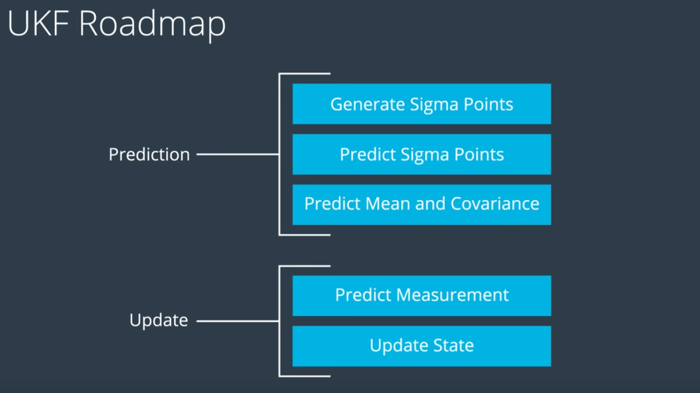
Image: Udacity Self-Driving Car Nanodegree 

A standard Kalman filter can only handle linear equations. Both the extended Kalman filter and the unscented Kalman filter allow you to use non-linear equations. The difference between EKF and UKF is how they handle non-linear equations. But the basics are the same: initialize, predict, update.

To measure how well the Unscented Kalman filter performs, the root mean squared error comparing the Kalman filter results with the provided ground truth will  be calculated afterwards. The simulator provides the ground truth state of the object to be tracked and displays the calculated root mean squared error (RMSE).

Here is a overview of all the necessary equations for calculating the UKF:

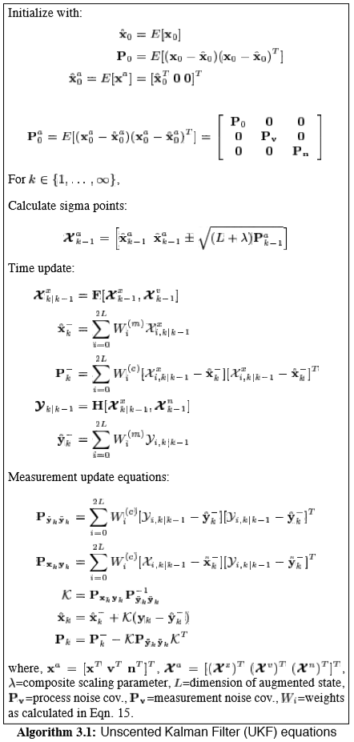  
Image: ["The Unscented Kalman Filter for Nonlinear Estimation"](https://www.seas.harvard.edu/courses/cs281/papers/unscented.pdf).

## File structure

Files in the Github src Folder:
1. main.cpp: 
  * communicates with the Term 2 Simulator receiving data measurements
  * calls a function to run the Unscented Kalman filter
  * calls a function to calculate RMSE
2. UKF.cpp:
  * initializes the Unscented Kalman filter
  * defines the predict and update functions
  * calls the predict funciton
  * calls the update function for either the lidar or radar sensor measurement
3. tools.cpp
  * function to calculate RMSE

## Results

**Initializing the Unscented Kalman Filter**

The initial values for the state variables will affect the Kalman filter's performance. Both the:
  * state vector x and 
  * the state covariance matrix P
need to be initialized for the unscented Kalman filter to work properly.

The state vector x contains x=[px,py,v,ψ,ψ˙]. You won't know where the bicycle is until you receive the first sensor measurement. Once the first sensor measurement arrives, px and py could be initialized.
For the other variables in the state vector x, you can try different initialization values to see what works best.
One strategie to initialize the state covariance matrix P is to start with the identity matrix.

**Process Noise**  

For the CTRV model, two parameters define the process noise:
  * σa2 representing longitudinal acceleration noise (you might see this referred to as linear acceleration) 
  * σψ¨2 representing yaw acceleration noise (this is also called angular acceleration)

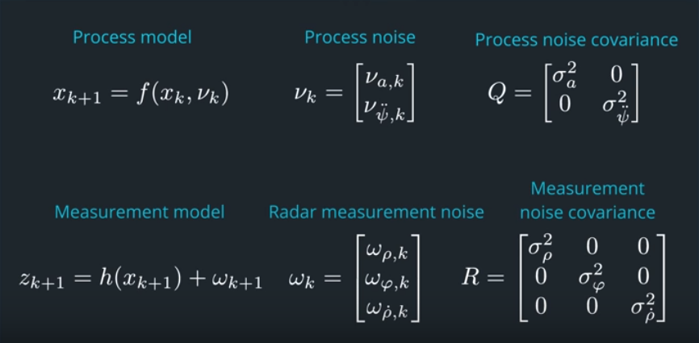
Image: Udacity Self-Driving Car Nanodegree  

In the project, both of these values need to be tuned. Different values have to be tested in order to get a working solution. Tuning will involve:
  * guessing appropriate parameter values
  * running the UKF filter
  * deciding if the results are good enough
  * tweaking the parameters and repeating the process

**Measurement Noise**  

Measurement noise parameters represent uncertainty in sensor measurements. In general, the manufacturer will provide these values in the sensor manual. 

**Comparing the UKF and EKF project results**

We see here a bicycle that is first driving straight and then turning into a circle. The path of the bicycle is shown in blue. The green line is the sequence of all measurements we receive both from LIDAR and RADAR. As before, these measurements are quite noisy. The orange dots are the estimation resource of the UKF fusing laser and radar measurements. The linear process model (EKF) in project 6 had problems following the turn. The CTRV model we're using with the UKF follows the turn quite nicely, and still provides a smooth position estimate. 

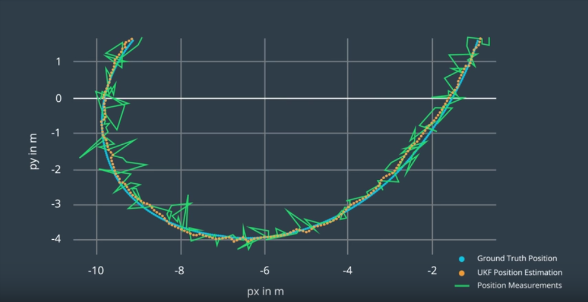
Image: Udacity Self-Driving Car Nanodegree  

Playing around with the process noise values, you can make either the estimation even smoother or force it to follow the measurements quicker. 

Also both projects use the same data file the RMSE values, especially for Vx and Vy are significant lower for the UKF project than the EKF project. This shows the advantage of using other motion models and the different handling  
of the non-linear equations between EKF and UKF. Remember Linearisation stinks!

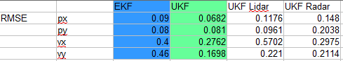

**Consistency Check on the Filter**

Usually you want to know of course, if you set up the noise parameters correctly. For that purpose you can run a consistency check on the filter.

_Theory on Consistency Check_  

At every time cycle, we calculate the measurement prediction zk + 1|k and the covariance matrix S of this prediction. Then we receive the actual measurement zk + 1 for that time step. In this example, everything looks okay. The actual measurement occurred somewhere inside the error ellipse. 

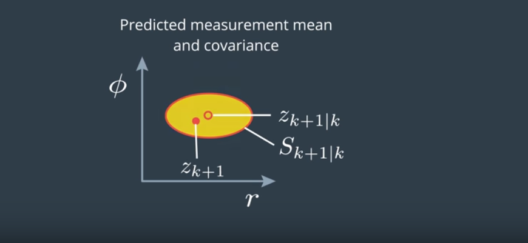
Image: Udacity Self-Driving Car Nanodegree  

But this might look differently. There are two cases you have to distinguish (but keep in mind, these are all stochastic processes and it might just be a natural coincidence):

* You constantly underestimate the uncertainty of the predicted measurement and the actual measurement zk + 1 for that time step is lying outside the error ellipse. Then your estimate is less precise than you think.
* You constantly overestimate the uncertainty of your system and the actual measurement zk + 1 for that time step is lying very close to the measurement predicted. It means your estimate is actually more precise than you think.

A filter is consistent if it provides a realistic estimation uncertainty. It is very easy to check the consistency of your filter. An important consistency check is called NIS, it means Normalized Innovation Squared. The innovation is the difference between the predicted measurement and the actual measurement. And normalized means you put it into relation to the covariance matrix S. The NIS is just a scalar number and super easy to calculate. 

  
Image: Udacity Self-Driving Car Nanodegree

The NIS value follows a distribution which is called chi-squared distribution and this table tells you the number you should expect for your NIS.

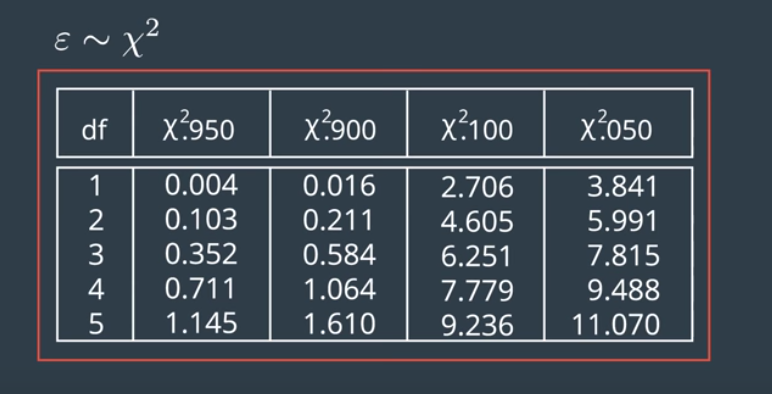  
Image: Udacity Self-Driving Car Nanodegree

DF means degrees of freedom. That's the dimension of our measurement space. If we have a three-dimensional radar measurement we have three degrees  of freedom.   
So what do all these numbers mean? 0.95 says statistically, in 95% of all cases, your NIS will be higher than 0.352. And this column says in 5% of all cases your NIS will be higher than 7.815. 
What you can always do when you design a filter is plot the 95% line. In our case, that's 7.8. And then for every time step k, calculate and plot also the NIS value. 

If you see something like this, then everything looks great. Sometimes you are over the 95% line, but that's what we expect: 

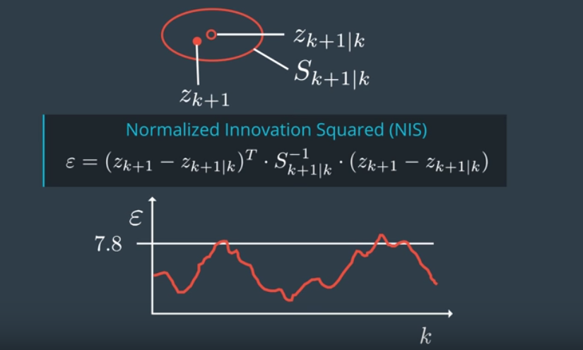  
Image: Udacity Self-Driving Car Nanodegree

If you see something like this, it means you underestimate the uncertainty in your system, like in the example we saw before: 

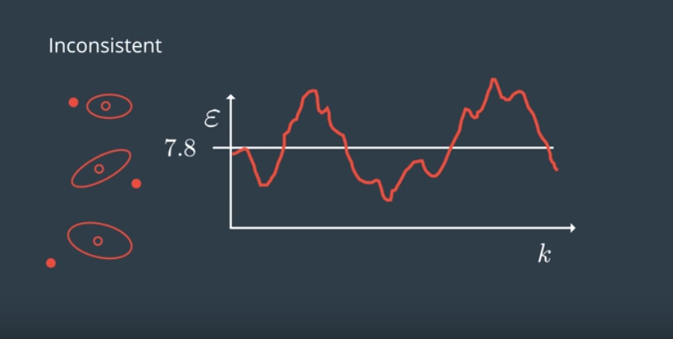  
Image: Udacity Self-Driving Car Nanodegree

If you see something like this, it means you overestimate the uncertainty in your system. Your estimations are actually more precise than you think: 

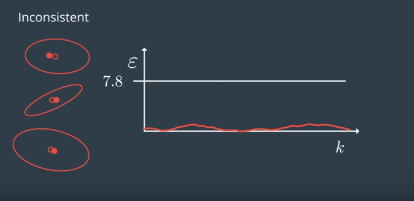  
Image: Udacity Self-Driving Car Nanodegree

Unfortunately, the NIS test does not tell you where the mistake comes from, but it gives you at least some feedback. 

Now this is how the consistency check of my filter looks like:

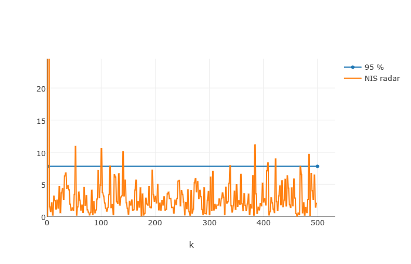

What you see here in orange are the NIS values of the three dimensional radar measurements. I also plotted the 95% line in blue. Just as expected, a small number of NIS values exceed this line. This indicates that a consistent filter was set up.

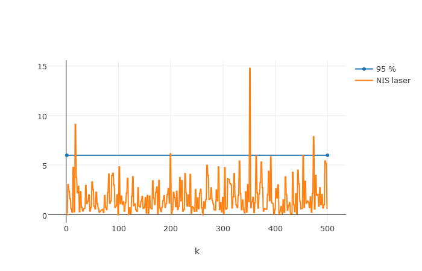

This is how the NIS values of the laser measurements look like. Be aware that the 95% line is at a different level in this case because the laser measurement is a two dimensional vector. 
Both diagrams show that the UKF is consistent, it means it provides a realistic covariance metrics. 

What really impressive is, how precise the UKF can estimate the orientation of the bicycle. None of our sensors is able to directly observe the orientation, but we still get a precise estimate. 

Even the yaw rate can be estimated providing useful results. For autonomous vehicles, the yaw rate of other vehicles is very important to know. Imagine another car starting to change lanes or a bicycle in front of you wants to do a left turn. In this case the yaw rate is the ultimate indicator for such a behavior prediction. 

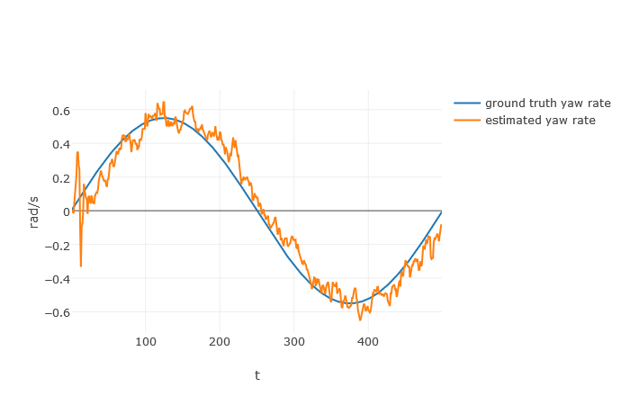

Summarization of the most important properties of the UKF as a sensor fusion tool for self driving cars:

1. with the UKF, you will be able to take noisy measurement data as input and provide a smooth position and velocity estimation of dynamic objects around you, without introducing a delay!
2. you can provide an estimation of the orientation and the yaw rate of other vehicles using sensors that can't even directly observe these things
3. the UKF also gives information on how precise the result is because it always provides a covariance matrix for every estimation
4. and you know that this covariance matrix is realistic if the UKF performs a consistency check.
The uncertainty of the estimation result is very important for self driving cars, because if the position of your leading vehicle is quite uncertain at some time, you better keep a little more distance.

## Visualisation Tools

Visualization of the output is courtesy of the Jupyter visualization notebook 
[Sensor Fusion Toolkit](https://github.com/udacity/CarND-Mercedes-SF-Utilities) from the 
Mercedes team that accompanies the project.

## Editor Settings

We've purposefully kept editor configuration files out of this repo in order to
keep it as simple and environment agnostic as possible. However, we recommend
using the following settings:

* indent using spaces
* set tab width to 2 spaces (keeps the matrices in source code aligned)

## Code Style

Please (do your best to) stick to [Google's C++ style guide](https://google.github.io/styleguide/cppguide.html).

## Results

The resulting videos are in the repo, if you are interested.  

## Contributing

No further updates nor contributions are requested.  This project is static.

## License

Term2_project7_unscented_kalman_filters results are released under the [MIT License](./LICENSE)