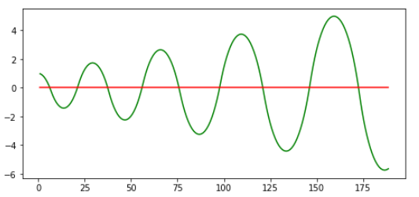
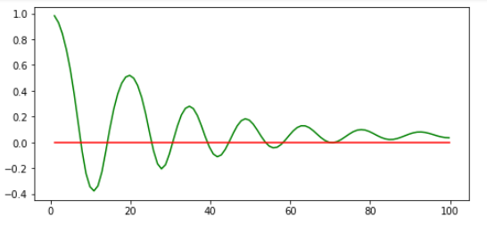
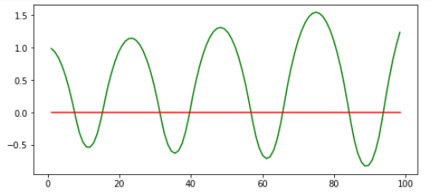
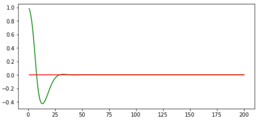

# PID Controller

## Overview

This projects implements a PID controller in C++for keeping the car on the lake race track by appropriately adjusting the steering angle to maneuver the vehicle around the track! The simulator provides you with the cross track error (CTE) and the velocity (mph) in order to compute the appropriate steering angle.
One more thing. Try to drive SAFELY as fast as possible! Get as near to 100mph by controlling the throttle. 

## Use Instructions

If you have already installed all the necessary dependencies for the projects in term 2 you should be good to go! If not, you should install them to get started on this project => [Getting Started for Term 2](../term2_How_to_get_started). 

1. Clone this repo.
2. Make a build directory: `mkdir build && cd build`
3. Compile: `cmake .. && make`
   * On Windows, you may need to run: `cmake .. -G "Unix Makefiles" && make`
4. Run it: `./pid`

Once you launched the executable, simply run the simulator app and select the PID Controller simulation.

## Goal of this project

Using `autonomous` mode within the simulator gives us access to the throttle, steering and cross-track error.  The primary goal of the project is to steer the car around the track using the cross-track error and a PID controller.  The PID controller is a common, simple, effective and widely accepted technique for actuating autonomous vehicles. The steering will be determined by the lateral distance from the center of the track using the PID controller.  Since we do not know the dynamics of the car, we will need to tune the controller. Upon doing so the car should be able to stay on the road adequately. The idea, of course, is that a car should be able to be controlled
based on a path, and in this case the path is simply the center of the road.  It is critical to be able to control the car, as in real-life situations with a computed path the car needs to behave as expected. Secondarily, speed regulation is an objective of the project. This is simply applying a second PID controller to control the speed in the context of a non-zero control value.

## The PID Controller and its Components

A **proportional–integral–derivative controller** (PID controller) is one of the most common control loop feedback mechanisms. A PID controller continuously calculates an **error function** (which in our case is the distance from the center of the lane) and applies a correction based on proportional (P), integral (I), and derivative (D) terms.

### Error difference (Proportional) P

The proportional (P) component: Acts inverse proportionally to the observed error value, i.e. the larger the error value, the larger the absolute control command value. This allows the car to steer proportional to the car's distance from the center of the lane, or cross track error (CTE). 
In general, increasing the proportional gain will increase the speed of the control system response. However, if the proportional gain is too large, the process variable will begin to oscillate. If Kp is increased further, the oscillations will become larger and the system will become unstable and may even oscillate out of control. Here you see a P-controller where the proportional gain is too large, starting to oscillate around the target line.

## Error rate of change (Derivative) D

The differential (D) component: Acts using the change rate of the error, i.e. the more the error changes between the last and the current time step, the larger the absolute control command value. It prevents overshooting and provides smoothing when correcting by calculating the derivative of the CTE. Large changes are emphasized but small changes have only a small effect, therefore with only a small portion left to the goal, steps to approach it are getting smaller and smaller. If  the D gain is too small the vehicle will keep on overshooting the target line. But if it's too high, it will never reach the target line and won't turn much at all.
A PD-controller oscillate around a line close to the target line but never reaches it. The oscillation is declining due to the D part of the controller.

Rising the P part of this PD-controller, the D part is no longer able to compensate the P component and the oscillation amplitude starts to rise.

Here the ratio of P and D part seems to be ideal. The controller seems to be fast enough to compensate fast changes and isn't oscillating. Only a small error is remaining - the Steady-State error. Steady-State error is the final difference between the process variable and set point. A phenomenon called integral windup results when integral action saturates a controller without the controller driving the error signal toward zero. 

## Error sum (Integral) I

The integral (I) component: Acts using the sum of all past observed errors, i.e. the greater the imbalance between negative and positive past observed errors, the larger the absolute control command value. These biases may include, but are not limited to systematic errors in hardware and software, steering drift, centrifugal pull around large turns and other externalities like gusts of wind.
This seems to be a useful PID-controller, reacting fast on changes and beeing able to compensate the Steady-State error:

## Process

### The PID Coefficients for the steering controller

Tuning the controller is actually more difficult than one might expect. There are two ways that the tuning can occur.  First, the car can be reset each time a tuning run is made.  Second, the tuning can occur continuously as the car drives. There are arguments to be made for both, but what I ultimately settled on was the first.  The reason for this is that while it is less flexible in determining dynamic coefficients, it is more repeatable. Using the tuning technique in this project, repeatability is very important, as it makes the total squared cross-track error more comparable.

As a starting point the initial coefficients were choosen manually according to this strategy (Ziegler-Nichols method):
*  Set all gains to zero.
*  Increase the P gain until the response to a disturbance is steady oscillation.
*  Increase the D gain until the the oscillations go away (i.e. it's critically damped).
*  Repeat steps 2 and 3 until increasing the D gain does not stop the oscillations.
*  Set P and D to the last stable values.
*  Increase the I gain until it brings you to the setpoint with the number of oscillations desired (normally zero but for a quicker response a certain oscillations with one overshoot is better).

Then the implemented twiddling technique could be used, proposed by Sebastian Thrun in his lecture, for fine tuning of the coefficients.
Twiddle is prone to find a local minima - that's why it is difficult to find optimal starting point using twiddling.

This process was started with a certain amount of steps (to have nearly the same part of the lap for all iteration steps) for example 2000. Once a best parameter set is evaluated, more steps are added and on that account a further part of the lap with more difficult turns is taken into the optimization process. This is done until at least one lap and the following two turns are part of the optimization process. Those two turns are more difficult in the second lap as the vehicle drives through this turns at a higher speed as it doesn't have to accelerate form speed = 0mph.

The coefficients after twiddling are: Kp: 3.2, Ki: 0.0002, Kd: 170.

### The PID Coefficients for the throttle controller

For the throttle controller a similar approach was choosen. The aim was to control speed to a desired max speed with consideration of the different hard turns. Therefore  a CTE function with the speed difference in a parabolic function (x2) and a polynomial function of the angle (x4) was calculated, allowing the vehicle to accelerate to the max speed in lap areas where the steering angles are low and to lower speed in turns depending on how hard they are. 
But the performance of the speed controller depends very much on the performance of the steering PID controller. If that could do the hardest turns you can drive at constant speed. But as the speed controller (as implemented here) doesn't know anything about a turn arising in some seconds the speed reduction starts too late and therefore lowers speed too much. It turned out to be a great challenge to get all parameters satisfactorily working together but it never reached the mean speed of a comparable constant speed choice the steering PID controller was barely able to manage. The only benefit of the speed PID controller is, that a higher max speed could be reached.

Here the final gain settings are: Kp = 18.0 Kd = 20 Ki = 0.002.

## Results

The resulting videos are in the repo, if you are interested. 

## Literature

[PID theory explained](http://www.ni.com/white-paper/3782/en/)

## Editor Settings

We've purposefully kept editor configuration files out of this repo in order to
keep it as simple and environment agnostic as possible. However, we recommend
using the following settings:

* indent using spaces
* set tab width to 2 spaces (keeps the matrices in source code aligned)

## Code Style

Please (do your best to) stick to [Google's C++ style guide](https://google.github.io/styleguide/cppguide.html).

## Contributing

No further updates nor contributions are requested.  This project is static.

## License

Term1_project1_lane_finding results are released under the [MIT License](./LICENSE)