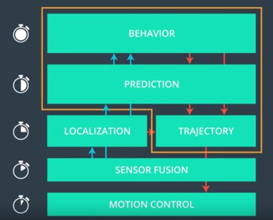
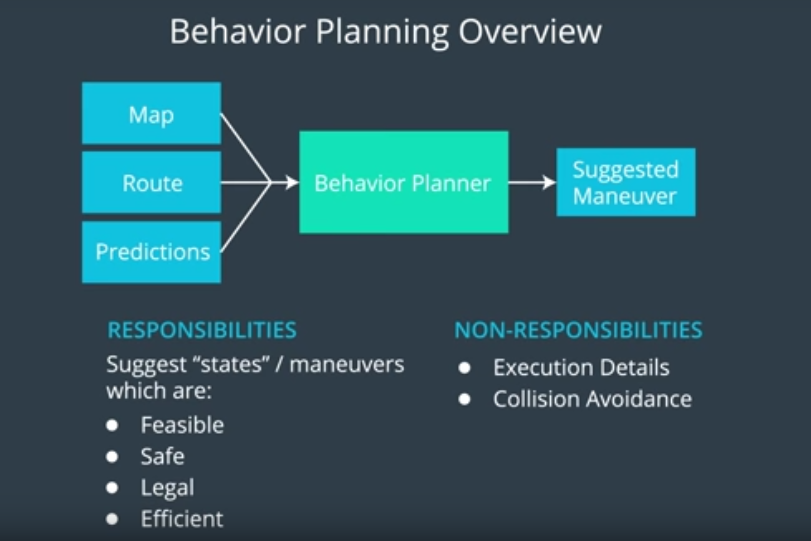
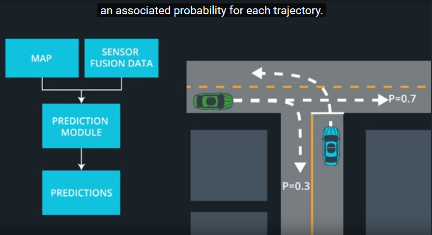
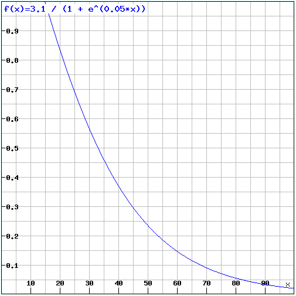
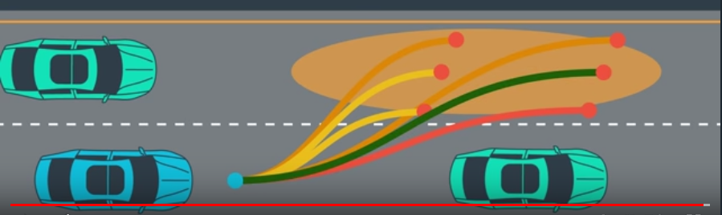

# Path Planning

## Overview

The process of path planning could be seen as the brain of an autonomous vehicle, which determines where to go and how to get there. The goal is to find a safe, legal, comfortable and efficient path from a starting point to a destination. The required algorithm consists of three steps:

1. **prediction:** involves estimating what other vehicles on the road might do next
2. **behavior:** requires the own vehicle to decide what maneuver to perform next
3. **trajectory:** selects and calculates an actual path to follow based on the decision from behavior

Therefore it receives information from localization, sensor fusion and uses map data (see image below). Finally the calculated trajectory is passed to the motion control to perform the desired behavior.

  
   Image: Udacity Self-Driving Car Nanodegree 

## Dependencies

If you have already installed all the necessary dependencies for the projects in term 3 you should be good to go! If not, you should install them to get started on this project => [Getting Started for Term 3](../term3_How_to_get_started). 

You can download the Term3 Simulator which contains the Path Planning Project from the [releases tab (https://github.com/udacity/self-driving-car-sim/releases).
 
## Basic Build Instructions

1. Clone this repo.
2. Make a build directory: `mkdir build && cd build`
3. Compile: `cmake .. && make`
   * On Windows, you may need to run: `cmake .. -G "Unix Makefiles" && make`
4. Run it: `./path_planning`

Once you launched the executable, simply run the simulator app and select the Path Planning simulation.

## Goal of this project

The goal for this project is to design a path planner module which is able to drive a car around a virtual 3 lane highway with a lot of traffic around. The highway is a loop with a length of 6946m and the car should be able to drive at least one complete round of about 4.32miles, change lanes to pass slower moving traffic and must not hit any other car. Our vehicle should try to get as close to the speed limit of 50mph as possible, but must not exceed this speed limit. For comfort reasons a maximal acceleration of 10m/s² and a jerk of 10m/s³ must not be exceeded. Therefore a smooth and safe trajectory is needed. Besides changing lanes it should also keep inside its lane.

### Path Planning Process

The implementation of the path planner in this project is summarized in the following steps:
1. From localization data determine ego car parameters
2. From sensor fusion data determine the traffic around the car, sort it by lane and find the closest cars ahead and behind
3. Start Behavior Planner using a Finite-state Machine
4. For each state generate predictions for several time-steps into future for the ego car as well as for the traffic around it
5. Determine the behavior by means of cost-functions which estimate the best state in future
6. Start Path Planning with determination of the position and velocity of the ahead car 50 * 0,02s in future for the chosen state
7. Calculate vehicle speed depending on ahead cars speed and distance
8. Produce new smooth trajectory using spline function and the map data

### File structure

Files in the Github src Folder:
1. `main.cpp`: 
    * data input and output
    * control of the workflow
2. `vehicle.cpp & vehicle.h`:
    * initializes the vehicle class 
    * sets all data for each telemetric dataset 
3. `coordinates.cpp & coordinates.h`:
    * all programs used for working with waypoints
    * frenet coordinates
    * XY coordinates
4. `helper.cpp & helper.h`:
    * all programs needed for traffic calculation
    * behavioral planner
    * path planning
5. `cost_functions.cpp & cost_functions.h`:
    * all the cost functions are contained here 
6. `constants.h`:
    * all constants used by the program
7. `json.h`:
    * JSON version 2.1.1
8. `spline.h`:
    * simple cubic spline interpolation library without external dependencies
    * (Copyright (C) 2011, 2014 Tino Kluge)

### Determine Ego Car Parameters and Construct Vehicle Object

The following data is received from the simulator module at each update step (depending on the time lag caused by performing the path planning process):

  1. localization data of the own car, consisting of [x, y, s, d, yaw and speed]
  2. the remaining part of the previous trajectory [x, y]-coordinates
  3. sensor fusion data from all other cars, which drive in our direction, consisting of [ID,  x, y, vx, vy, s and d]
 
In addition there is the 'world'-map, which consists of 181 waypoints forming our reference path around the highway loop. Each waypoint data-set comprises [ x, y, s, dx, dy].

With this data additional values are calculated for the ego car like acceleration and the current data-set is fed to the vehicle class object. 
With sensor fusion data, all other vehicles are sorted according to their lane and position to the ego car. A vector with data-sets of six cars (car ahead and behind for 3 lanes) is received as a result with additional information (function `Lane_Traffic` in `helper.cpp`). The data-set now comprises the following values [id, x, y, vx, vy, s, d, v, s-dist, lane, traffic ahead, acc] with:  

  - v = velocity of this car
  - s-dist = distance form ego car 
  - lane = current lane of this car
  - traffic ahead = number of cars ahead form ego car in this lane
  - acc = acceleration of this car
 
If there is no car in front or behind in a lane, this data-set is filled with pseudo values which can be identified as 'no car' in further program steps.

### Behavior Planning Modul

The behavior planner uses a so called Finite State Machine to solve the behavior planning problem and to decide which maneuver to do next. The behavior planner makes decisions based on a finite set of discrete states. In this case a Finite State Machine with 5 different states was chosen (*'Keep Lane'* (KL), *'Lane Change Left'* (LCL), *'Lane Change Right'* (LCR), *'Double Lane Change'* (DLC) and *'Changing Lane'* (CL)). It is initialized with the state 'Keep Lane'.  
To decide which state to transit next, the Finite State Machine needs to handle the following input, like:  

   - current state
   - localization data
   - fusion data
   - map
   - limitations (like speed, jerk..)
   - predictions

  
   Image: Udacity Self-Driving Car Nanodegree 

### Predictions

For each state we have to calculate the predictions where the ego car, as well as the six cars around it, will be in future. Therefore we cycle through all possible states and trajectories for those cars in the prediction step. Here a time-step of 0.5 second and a time horizon of in total 5 seconds is used. To simplify and speed up the prediction step, only a simple model for the traffic around the ego car is used. The cars drive at a constant speed and are keeping their lanes. The performance of this prediction model proved to be sufficient for a working behavior module in this case. However the prediction step of the ego car was calculated with constant acceleration but a simple lane changing model of instantaneously changing lane (which will be the worst case for safety reasons).

  
   Image: Udacity Self-Driving Car Nanodegree 

### Cost Functions

The key part for choosing a proper transition is the design of reasonable cost-functions. Here we want to penalize and reward the right things. Therefore we sum up the costs derived from different cost-functions, designed for different purposes. In this case the following cost-functions are used:

  1. **lane cost:** cost for not being in the middle lane
  2. **cost for speed of car in front:** we prefer to stay in the lane with cars at a higher speed
  3. **cost for traffic ahead:** we prefer to stay in a lane with less traffic ahead
  4. **cost for collisions:** collisions are extreme expensive (only calculated for lane changes to check if it's feasible to do a lane change)
  5. **cost for being below safety buffer threshold:** being below the safety buffer threshold is expensive
  6. **cost for distance from car in front:** we prefer situations with cars in front of us which are far away form us

As an example for the design of a cost-function, *the function for the distance from the car in front*, is shown in the following picture:

  

Below 15m (in this case also the collision margin) the value is 1. Distances greater than 15m generate values according to the function above. The value is a exponential decrease with values near 0 for cars being further than 100m away from the ego car.

To tweak and balance the cost judgment a set of weights is introduced which can be tuned to get the desired result. The cost summation for all time-steps for all different states are gained as a result. After that the trajectory with the lowest cost is selected. 

As a double lane change in just one step would introduce a high jerk as well as being more unsafe, it is divided into two steps. To force the car to make only one lane change, which hasn't the lowest cost as otherwise it would have been chosen before, we only check if it is feasible to go to that lane. In the next update step the behavior planner identifies the solution with the lowest cost again. Most likely it will be the target lane of the double lane change. But if anything around happened in the meantime, it can also lead to another preferred state and thus gives an additional safety check.

### Path Planning Modul

Now in the last part of the path planning module, a new trajectory has to be generated, depending on the decision made in the behavior module. As only x,y coordinates are passed to the simulator the velocity is also incorporated in this data as the simulator assumes a constant time-step size of 0.02 seconds. Therefore for each new x,y coordinate the correct velocity has to be estimated.

#### Velocity Calculation

To adapt the speed of our car to the traffic and the circumstances we can differentiate between 3 cases. 

  1. If the next car ahead is more than 60m away or there is no car in front of us we can use the maximal acceleration and set the goal to the speed limit of 50mph. 
  2. If the car in front of us is less than 60m but more than 30m away, a speed target is calculated so that it is more to the speed limit for distances closer to 60m and more to the speed of the car in front of us as the distance is closer to 30m. In almost the same manner the possible acceleration is determined to ensure a smooth velocity change. 
  3. If the car in front of us is less than 30m away we should be able to break with maximal deceleration and adjust our speed to the car in front of us. As for the project result there is no difference in having a collision or changing acceleration with a value of more than 10m/s², there will be no emergency break to avoid collisions while staying in the lane. This occurs sometimes when  another car changes to our lane suddenly and the time to react is too short.

If the speed of the ego car is higher than the target speed, it will decelerate other wise accelerate, until we hit the target.

#### Trajectory Planning

The new trajectory starts with the remaining way-points of the previous path or when there are only very few points left with the current car position. Lacking points are calculated as follows:
Taking the last two points of the previous path or the starting point as a reference 3 more evenly spaced points (e.g. 30m) in the target lane are added to a way-point-set. This set is transformed to the local car's coordinate system and a spline is calculated using the c++ cubic spline library from Tino Kluge. That creates really smooth trajectories without worrying about all the math behind. With this spline, the estimated target speed and the desired acceleration the next x,y way-points in the local coordinate system are calculated. Afterwards the way-point-set is transformed back to the global coordinate system and passed to the simulator.

  
   Image: Udacity Self-Driving Car Nanodegree 

## Results

  

The path planner project is one of the most interesting, complex and demanding ones. This solution works quite well but not incident-free as you can see in the picture above. After running for more than 38 miles a certain incident happened. There seems to be a lot of room to make things perfect, like using different trajectories along with Naive Bayes for the prediction of the position of all the cars around us. Another point is that a planned path always gets executed in its entirety, i.e. the initiation of a new maneuver is only possible after the last path point of the current path the car is following. This obviously leads to a trade-off between longer planning horizons and timely reaction to sudden changes in the environment.
Nevertheless it was great fun to manage the program structure, tweaking all parameters and see the car running around with this impressive simulator.

  

The resulting [video](./results/SDC_Path_Planning_Project.mp4) is in the repo, if you are interested. 

## Literature

[Practical Search Techniques in Path Planning for Autonomous Driving](./resources/dolgov_gpp_stair08.pdf)

[A Path Planning and Obstacle Avoidance Algorithm for an Autonomous Robotic Vehicle](./resources/Thesis_Ghangrekar.pdf)

## Editor Settings

We've purposefully kept editor configuration files out of this repo in order to
keep it as simple and environment agnostic as possible. However, we recommend
using the following settings:

* indent using spaces
* set tab width to 2 spaces (keeps the matrices in source code aligned)

## Code Style

Please (do your best to) stick to [Google's C++ style guide](https://google.github.io/styleguide/cppguide.html).

## Contributing

No further updates nor contributions are requested.  This project is static.

## License

Term3_project11_path_planning results are released under the [MIT License](./LICENSE)