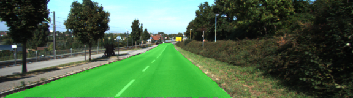
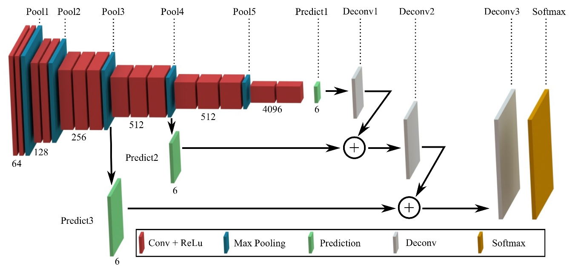
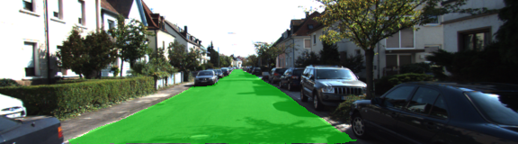
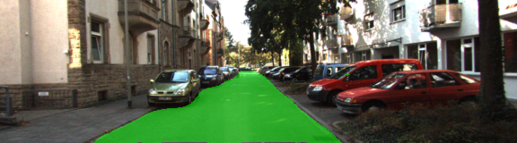

# Semantic Segmentation
[](http://www.udacity.com/drive)

## Overview

In this project, a Fully Convolutional Network (FCN) to identify road pixels from images will be trained. We use the VGG16 network and added skip layers, 1x1 convolutions and upsampling to build the FCN. For training the Kitti Road Dataset is utilized.

<p align="center">
  
</p>

## Dependencies

Make sure you have the following is installed:
 - [Python 3](https://www.python.org/)
 - [TensorFlow](https://www.tensorflow.org/)
 - [NumPy](http://www.numpy.org/)
 - [SciPy](https://www.scipy.org/)

##### Dataset
Download the [Kitti Road dataset](http://www.cvlibs.net/datasets/kitti/eval_road.php) from [here](http://www.cvlibs.net/download.php?file=data_road.zip).  Extract the dataset in the `data` folder.  This will create the folder `data_road` with all the training and test images.
 
## Basic Build Instructions

Run the following command to run the project:
```
python main.py
```
**Note** If running this in Jupyter Notebook system messages, such as those regarding test status, may appear in the terminal rather than the notebook.

The way it is set up in this repo, using a GTX 1060 it takes about 10-15 minutes to train.

## Tips

- The link for the frozen `VGG16` model is hardcoded into `helper.py`.  The model can be found [here](https://s3-us-west-1.amazonaws.com/udacity-selfdrivingcar/vgg.zip)
- The model is not vanilla `VGG16`, but a fully convolutional version, which already contains the 1x1 convolutions to replace the fully connected layers.  
- The original FCN-8s was trained in stages. The authors later uploaded a version that was trained all at once to their GitHub repo. The version in the GitHub repo has one important difference: The outputs of pooling layers 3 and 4 are scaled before they are fed into the 1x1 convolutions. As a result, the model learns much better with the scaling layers included. The model may not converge substantially faster, but may reach a higher IoU and accuracy. 
- When adding l2-regularization, setting a regularizer in the arguments of the `tf.layers` is not enough. Regularization loss terms must be manually added to your loss function. otherwise regularization is not implemented.

## Initialization and Tests

When run, the project invokes some tests around building block functions that 
help ensure tensors of the right size and description are being used. Once the tests are complete, the code checks for the existance of a base trained VGG16 model. If it is not found locally it downloads it. Once it is available, it is used as the basis for being reconnected with skip layers and recapping the model with an alternative top end for semantic segmentation.  

## Setting up the Neural Network with VGG16

VGG16 is a good start for an image semantic segmentation mechanism.  Simply
replacing the classifier with an alternative classifier based on flattened 
image logits is a good start.  However, this tends to not have as good 
performance in terms of resolution as we would desire.  The reason for this is 
the structure of the model with the reduction of resolution.  One way of 
improve this performance is to merge the outputs of the layers, scaled to 
the right resolution.  This works by producing cummulative layer activations
and the ability, due to the convolutional kernels, to spread this activation
locally to neighboring pixels.  This change in layer connectivity is called
`skip layers` and the result is more accurate segmentation, somewhat like 
the so-called `U net`. This implementation is based on the 2015 paper [Fully Convolutional Networks for Semantic Segmentation](https://arxiv.org/abs/1605.06211) from UC Berkeley. 

<p align="center">
  
</p>

Here we are focusing on layers 3, 4 and 7. First, each of these layers have a 1x1 convolution layer added. Next, layers 7 and 4 are merged, with layer 7 being upsampled using the `conv2d_transpose()` function. The result of this cummulative layer was added to layer 3, the cummulative layer being upsampled first.  The final result is upsampled again.  What this basically accomplishes is creating a skip-layer encoder-decoder network. The critical part, the encoder, is the pre-trained VGG16 model, and it is our task to train the smaller decoder aspect to accomplish the semantic segmentation that we 
are trying to achieve.

## Optimization

The network is trained using cross entropy loss as the metric to minimize. The
way this is accomplished is essentially to flatten both the logits from the last decoder layer into a single dimensional label vector. The cross entropy
loss is computed against the correct label image, itself also flattened. The Adam-Optimizer is used to minimize this, because it's a good choice for most deep learning projects.
As for the framework, TensorFlow is used. Unfortunately, the TensorFlow intersection over union function is not one that is compatible with minimization, so it wasn't used.

## Training 

The network has been trained on an Amazon p2.xlarge GPU instance with around 11GB of graphic memory. The basic training process is simply going through the defined epochs, batching and training. The loss reported is an average over the returned losses for all batches in an epoch. Once the training is complete, the test images are processed using the provided helper function. The model, the metadata and the graph definition are also saved in the process. The benefit is that an optimizer on the graph for use in faster inference applications could be used later.

## Hyperparameter Selection

The hyperparameters have been determined with a random search strategy:

 * Learning rate = 0.000055
 * Dropout = 0.89
 * Epochs = 43
 * Batch size = 5

This batch size seemed to facilitate a better generalization and more rapid reduction than with a larger batch sizes. The final loss value is at around 0.03.

## Results

The results are *surprisingly good*.  The image at the top is some of the output. Of the hundreds of test images, there are only very few that do not have fairly adequate road coverage. Places where it seems to fail most include:

 * Small regions, such as between cars or around bicycles
 * Wide expanses of road with poorly defined boundaries
 * Road forks with dominant lane lines
 * Very different lighting conditions

Surprisingly, it works very well at distinguishing between roads and intersecting railroad tracks. This is probably related to why it does not segment the road at intersections with dominant lane lines as well, as the high contrast parallel lines have few examples in the training set.

Example images:

<p align="center">
  
</p>

<p align="center">
  
</p>

<p align="center">
  
</p>

<p align="center">
  
</p>

All images are found in the [runs directory](./runs/1509812541.5957403/) in this repo, if you are interested.

## Literature

[Fully Convolutional Networks for Semantic Segmentation](https://arxiv.org/abs/1605.06211)

[Convolutional Patch Networks with Spatial Prior for Road Detection](./resources/Convolutional_Patch_Networks_with_Spatial_Prior_for_Road_Detection.pdf)

[A guide to convolution arithmetic for deep learning](./resources/A_guide_to_convolution_arithmetic_for_deep.pdf)

[Learning Affordance for Direct Perception in Autonomous Driving](./resources/Learning_Affordance_for_Direct_Perception_in_Autonomous_Driving.pdf)

[Convolution Arithmetic Tutorial](http://deeplearning.net/software/theano/tutorial/conv_arithmetic.html)

[Semantic Segmentation Deep-Learning](http://blog.qure.ai/notes/semantic-segmentation-deep-learning-review)

[Transpose Convolution in Tensorflow](http://cv-tricks.com/image-segmentation/transpose-convolution-in-tensorflow/)

[Intersection over Union IoU](https://www.pyimagesearch.com/2016/11/07/intersection-over-union-iou-for-object-detection/)

## Contributing

No further updates nor contributions are requested.  This project is static.

## License

Term3_project12_semantic_segmentation results are released under the [MIT License](./LICENSE)