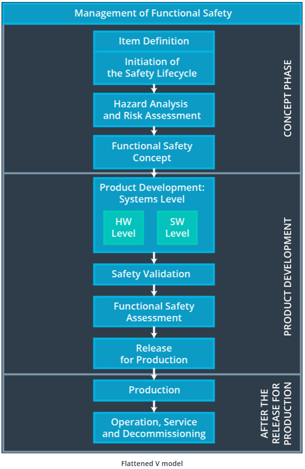
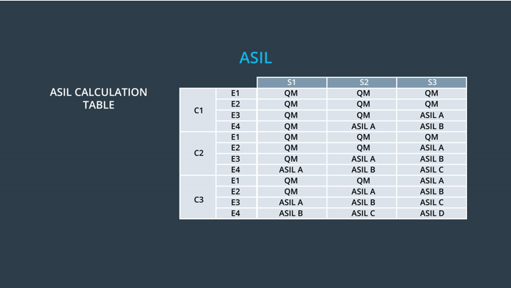

# Functional Safety Plan

## Overview

Functional safety grew out of the increasing use of E/E (Electronic and Electrical) systems for control systems. Currently, functional safety is used across many industries including avionics, automotive, railroad and the medical device industries.
The most generic standard is IEC 61508, which originated from industrial markets. It currently exists as a standard in the IEC/ISO basic safety publication, which covers "general functional safety," for a number of industries. ISO 26262 specifically applies to automotive passenger vehicle electrical and electronic systems. The ISO 26262 standard is an offshoot of the IEC 61508 standard.

  
    Image: Udacity Self-Driving Car Nanodegree  

## Goal 

Vehicles have a number of different systems including hydraulic, mechanical, electrical, electronic, and chemical. Functional safety is a part of overall automotive safety and specifically refers to reducing risks in electrical and electronic systems. It looks at what happens when the system does something that it was not supposed to do, which is called a malfunction. To methodically reduce risks in passenger vehicle's electric/electronic systems, functional safety standards for the automotive industry (ISO 26262) are used.

Goal of this project is to create an example safety case for a lane assistance system considering the Road Vehicles Functional Safety Standard ISO 26262. We start with a hazard analysis and risk assessment, create further documentation for functional and technical safety concepts and finally software and hardware requirements.

As a result of this project, following reports were created that document the functional safety of a lane assistance system:

  - [Safety Plan](./results/01_SafetyPlan_LaneAssistance.pdf)
  - [Hazard Analysis and Risk Assessment](./results/02_HazardAnalysisAndRiskAssessment.ods)
  - [Functional Safety Concept](./results/03_FunctionalSafetyConcept_LaneAssistance.pdf)
  - [Technical Safety Concept](./results/04_TechnicalSafetyConcept_LaneAssistance.pdf)
  - [Software Safety Requirements and Architecture](./results/05_SoftwareRequirementsAndArchitecture_LaneAssistance.pdf)

This safety case does not contain an entire functional safety analysis from scratch but focuses on parts of a lane assistance system.

  
    Image: Udacity Self-Driving Car Nanodegree  

## Contributing

No further updates nor contributions are requested.  This project is static.

## License

Term3_project13_functional_safety_plan results are released under the [MIT License](./LICENSE)