## System Integration Project

## Overview

The goal of this project is to enable Carla to drive around our test track using waypoint navigation. Carla will do this while avoiding obstacles and stopping at traffic lights.

  
    Image: Udacity Self-Driving Car Nanodegree  

## Introduction

Carla the Udacity self-driving car has 4 major subsystems:

  - Sensor subsystem, which constists of the hardware components that gather data about the environment. This subsystem includes lidar, radar and even GPS sensors mouted on the car.

| 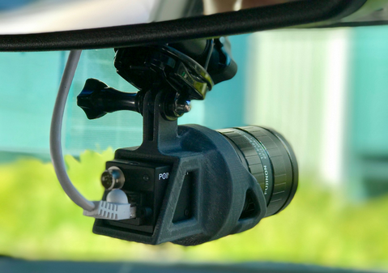 | 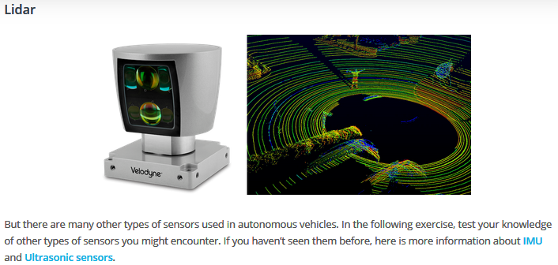|
| :---:         |     :---:      |

Image: Udacity Self-Driving Car Nanodegree  

  - Perception subsystem, consists of software to process sensor data.
  - Planning subsystem, uses the output from perception for behavior planning and for both sorth and long term path plan.
  - Control subsystem, which ensures that the vehicle follows the path provided by the planning subsystem and sends control commands to the vehicle.

### The Perception Subsystem

The perception subsystem processes data from sensor into structured information that can eventually be used for path planning or control. This is where most of the vehicles analysis of the environment takes place. We can further divide the perception subsystem ifself into two underlying subsystems:
  - detection
  - localization
The localization subsystem is responsible for using sensor and map data to determine the vehicle’s precise location. 
The detection subsystem is resonsible for understanding the surrounding environment. This subsystem includes software components such as:
  - lane detection
  - traffic sign and traffic light detection classifier
  - object detection and tracking
  - free space detection

The perception subsystem passes the data from localization and detection to the planning subsystem. The planning subsystem determines what maneuver the vehicle should undertake next.

### The Planning Subsystem

Once data from the sensors has been processed by the perception subsystem, the vehicle can use that information to plan its path. There are several components of the planning system:
  - route planning, responsible for high-level decisions about the path of the vehicle between two points on a map
  - prediction, estimates what actions or maneuver other objects might take in the futur
  - behavior planning, determines what behavior the vehicle should exhibit at any point in time
  - trajectory generation,  based on the desired immediate behavior it will determin which trajectory is best for executing this behavior

Once the vehicle has a planned trajectory the next step is to execute that trajectory. This is the responsibility of the control subsystem.

### The Control Subsystem

The last subsystem in the vehicle is the control subsystem. This subsystem contains software components to ensure that the vehicle follows the path specified by the planning subsystem. The control subsystem may include components such as PID controllers, model predictive controllers or other controlles.

  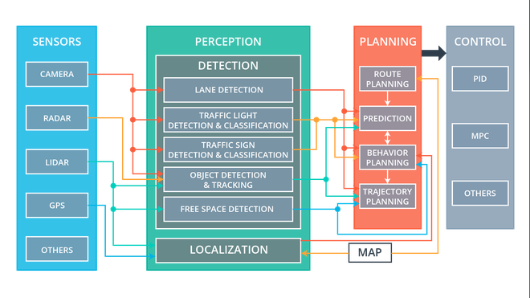
    Image: Udacity Self-Driving Car Nanodegree  

### Robot Operating System (ROS)

ROS is an open source robotic framework that provides libraries and tools for working with hardware and for passing messages between components. ROS provides scaffolding to integrate the components of the car. 

  - ROS is not an operating system in the typical sense, but like an OS, it provides a means of talking to hardware without writing your own device drivers. 
  - It also provides a way for different processes to communicate with one another via message passing. 
  - Lastly, ROS features a sleek build and package management system allowing to develop and deploy software with ease.
   
ROS also has tools for visualization, simulation and analysis, as well as extensive community support and an interface to numerous powerful software libraries.

On the software side, ROS manages the three high level steps of perception, decision making and actuation by breaking each of them down into many small unit processes called nodes. Typically, each node on the system is responsible for one small and relatively specific portion of the robot's overall functionality.
There may be nodes for each sensor and actuator in the system, as well as nodes for things like position estimation, behavior execution and motor control. At the center of this collection of nodes is the ROS Master which acts as a sort of manager of all the nodes.

  
    Image: Udacity Self-Driving Car Nanodegree  

The ROS Master maintains a registry of all the active nodes on a system.
It then allows each node to discover other nodes in the system and
establish lines of communication with them. In addition to allowing nodes to locate one another and communicate, the ROS Master also hosts what's called the parameter server. 

Nodes can also share data with one another by passing messages over what are called topics. A topic is simply a named bus which you can think of as a pipe between nodes through which messages flow. In order to send a message on a topic, a node must publish to it. Likewise, to receive a message on a topic, a node must subscribe to it. 

Passing messages over topics between publishers and subscribers is useful but it's not a one size fits all communications solution. There are times when a request response pattern is useful. For these types of interactions, ROS provides what are called services.

Like topics, services allow the passing of messages between nodes. However, unlike topics, a service is not a bus and there are no publishers or subscribers associated with them. Instead, nodes, which are interacting via services on a one to one basis, are using a request and response messages.  

  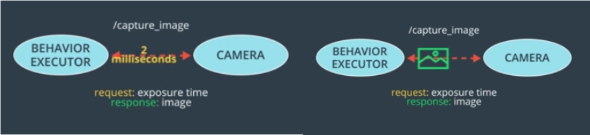
    Image: Udacity Self-Driving Car Nanodegree  

## Implementation Details

### Traffic Light Image Classification

The perception subsystem dynamically classifies the color of traffic lights in front of the vehicle. In the given simulator and test site environment, the car faces a single traffic light or a set of 3 traffic lights in the same state (green, yellow, red, none).
Thankfully due to the recent advancements in Deep Learning and the ease of use of different Deep Learning Frameworks like Caffe and TensorFlow that can utilize the immense power of GPUs to speed up the computations, this task has become really simple. Here traffic light classification is based on pre-trained on the COCO dataset model [ssd_mobilenet_v1_coco](http://download.tensorflow.org/models/object_detection/ssd_mobilenet_v1_coco_11_06_2017.tar.gz) from https://github.com/tensorflow/models/blob/master/research/object_detection/g3doc/detection_model_zoo.md

But first we have to gather our training data. The simulator images look something like this:

|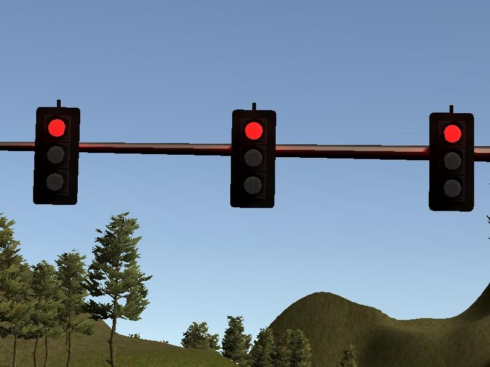 | 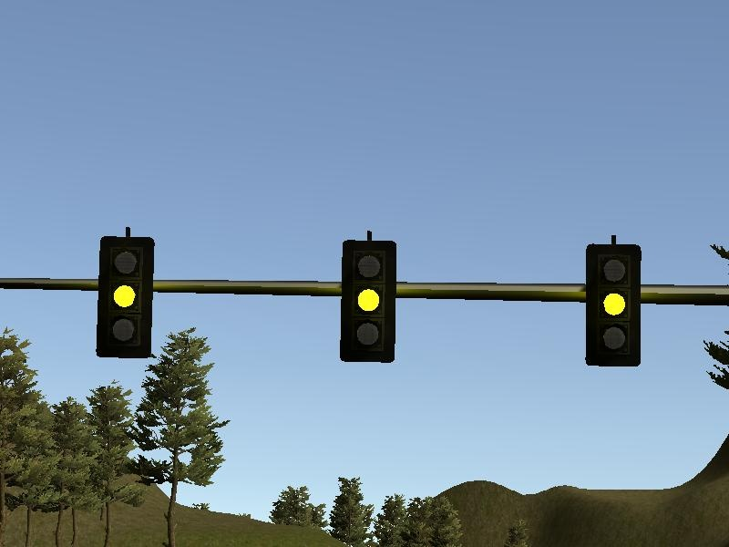 |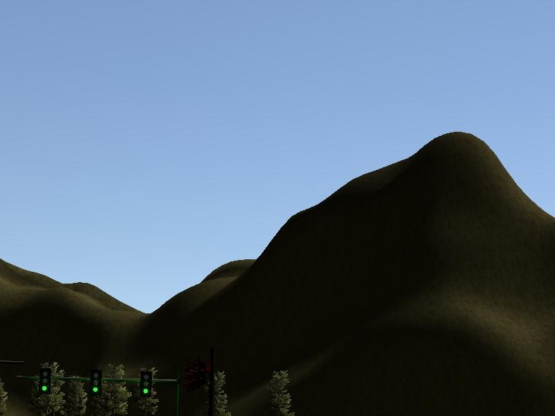 |
| :---:         |     :---:      |     :---:      |

While the images from the test lot look something like this:

|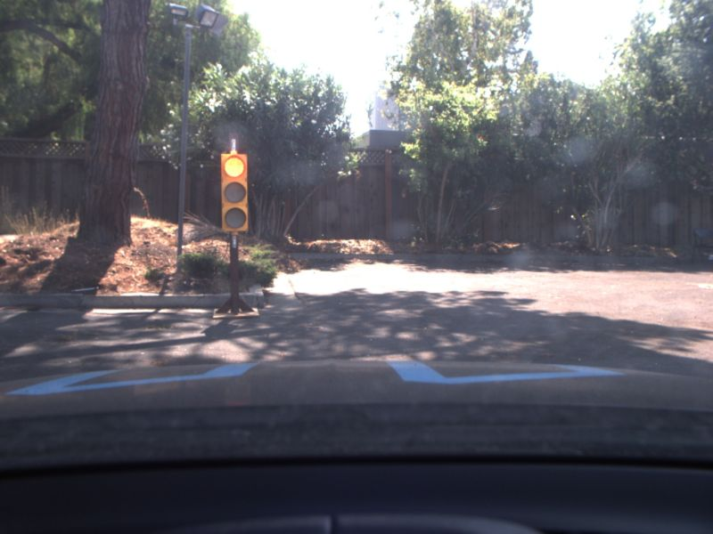|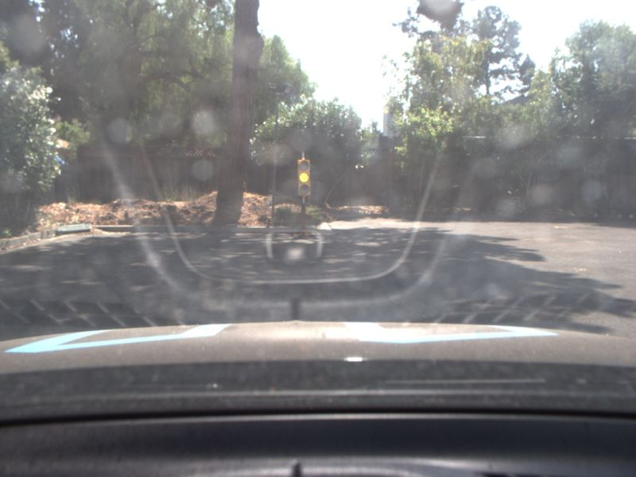 |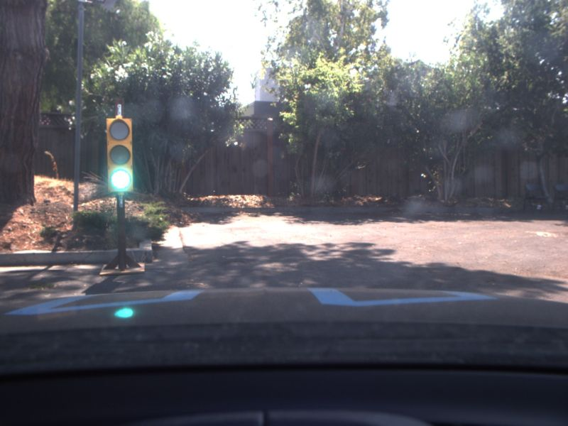 |
| :---:         |     :---:      |     :---:      |

The training data was a combination of simulator images and Udacity track images so that the classifier would be able to generalize and manage also the real test track. The total number of training features used was 3730.

All the images where manually annotated with the open source tool [LabelImg](https://github.com/tzutalin/labelImg). For training the model with the API, we first need to convert our data into the TFRecord format. This format basically takes your images and the yaml file of annotations and combines them into one that can be given as input for training. You can find everything you need to know on the [tensorflow/model](https://github.com/tensorflow/models/tree/master/research/object_detection) Github page.

So in the end, we need the following things to train our classifier:

  - COCO pre-trained network models
  - the TFRecord files
  - the label_map file with our classes
  - the image data-set
  - the TensorFlow model API

TensorFlow team also provides sample config files on their repo for setting up an object detection pipeline what we need to do next. At first two models were used:  
  - ssd_inception_v2_coco 
  - faster_rcnn_resnet101_coco 
   
The advantage of the second model is a higher accuracy at the risk of being to slow for a real time application in a self driving car. The first model is less accurate but pretty much faster. In the end this did the job.

To train the models the num_classes were adjusted to 4, all path for the model checkpoint, the train and test data files as well as the label map. An important thing is to reduce the max detections per class to 50 or less. In terms of other configurations like the learning rate, batch size and many more, their default settings were used.
The data_augmentation_option is very interesting. A full list of options can be found [here](https://github.com/tensorflow/models/blob/a4944a57ad2811e1f6a7a87589a9fc8a776e8d3c/object_detection/builders/preprocessor_builder.py) (see PREPROCESSING_FUNCTION_MAP). Augmentation was used and included the following random transformations:  

  - RGB to Gray  
  - Width/Height shift
  - Brightness
  - Horizontal image flip
  - Crop

With the trained models the detection and classifications was really good. Here some examples of classifications with the ssd_mobilenet_v1_coco:

|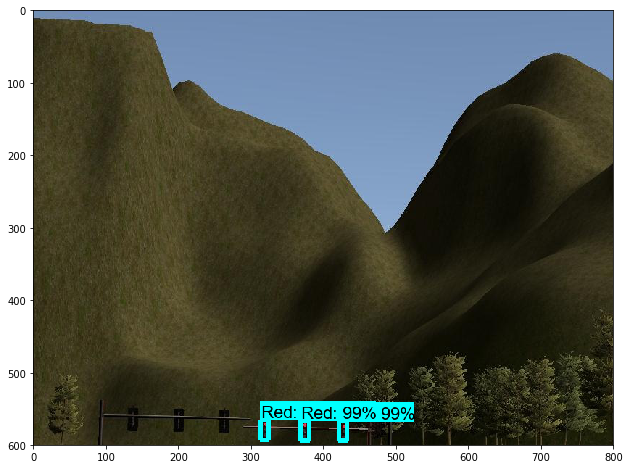| |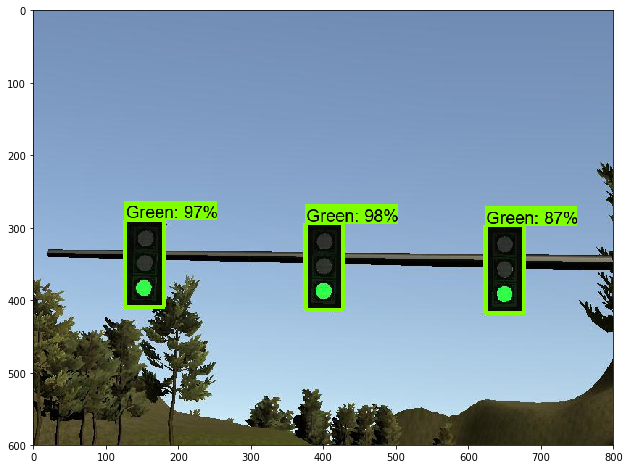 |
| :---:         |     :---:      |     :---:      |

While the images from the test lot are classified as follows:

|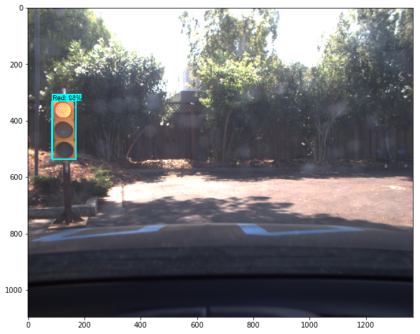|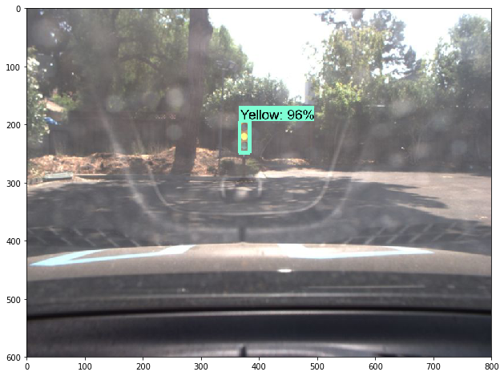 |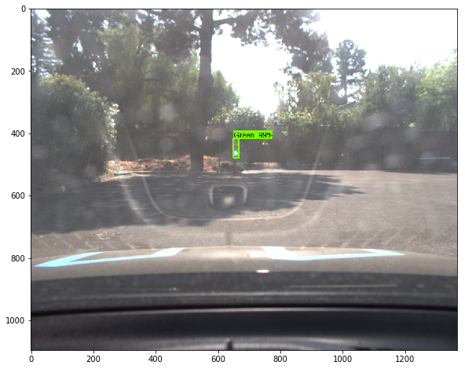 |
| :---:         |     :---:      |     :---:      |

The ROS traffic light detector is implemented in node `tl_detector` in classes `TLDetector` and `TLClassifier`. `TLDetector` is responsible for finding a nearest traffic light position and calls `TLClassifier.get_classification` with the current camera image. `TLClassifier` uses the SSD MobileNet model to classify the traffic light color (red, yellow, green, none). If at least 2 consecutive images were classified as red then `TLDetector` publishes the traffic light waypoint index in the `/traffic_waypoint` topic.

Here in the video from the test lot the classification results are depicted:

  

### Waypoint Updater

As the vehicle moves along a path, the waypoint updater is responsible for making changes to the planned path. Waypoint updater publishes the next 75 waypoints ahead of the car position, with the velocity that the car needs to have at that point. Each 1/20 seconds, it does:

  - Update of closest waypoint. It does a local search from current waypoint until it finds a local minimum in the distance. 
  - Update of velocity. If there is a red ligth ahead, it updates waypoint velocities so that the car stops `~stop_distance` (*node parameter, default: 5.0 m*) meters behind the red light waypoint. Waypoint velocities before the stop point are updated considering a smooth deceleration.

Traversed waypoints are dequeued and new points enqueued, preserving and reusing those in the middle. When a light-state changes, the entire queue is updated as already discribed. 

### Drive By Wire

The drive-by-wire node adjusts steering, throttle and brakes according to the velocity targets published by the waypoint follower (which is informed by the waypoint updater node). If the list of waypoints contains a series of descending velocity targets, the PID velocity controller (in the twist controller component of DBW) will attempt to match the target velocity.

#### Steering
Steering is handled by a predictive steering which is implemented in the `YawController`class. 

#### Throttle

Throttle is controlled by a linear PID by passing in the velocity cross-track-error (difference between the current velocity and the proposed velocity).

#### Brake

If a negative value is returned by the throttle PID, it means that the car needs to decelerate by braking. The braking torque is calculated by the formula `(vehicle_mass + fuel_capacity * GAS_DENSITY) * wheel_radius * deceleration`.

## Results

Here a short cutout from the simulator track is showing the performance of the self-driving car.

  

The resulting [videos](./results/system_integration_project.mp4) are in the repo, if you are interested.  

## Contributing

No further updates nor contributions are requested.  This project is static.

## License

Term3_capstone_project results are released under the [MIT License](./LICENSE)
